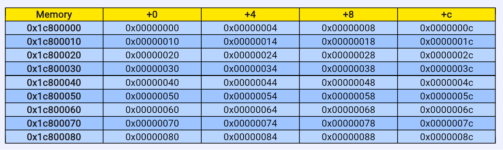
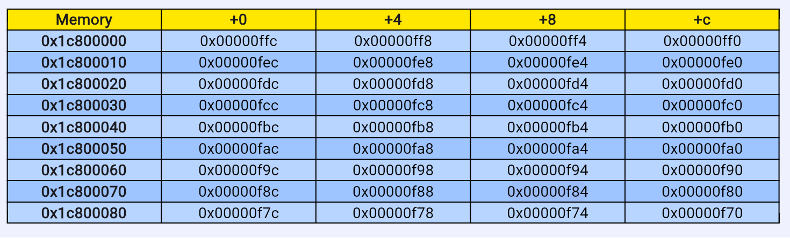

# LAB2 实验报告
                                                    PB22111639 马筱雅

###  1 实验目的
1. 学习龙芯架构的32位指令码，掌握基本的算术逻辑运算、访存、转移等指令的用法
2. 运用LA32R指令设计冒泡排序汇编算法，并导出相应coe文件
3. 熟悉使用LARS将汇编代码转化为coe文件，并进行调试和运行的方法
###  2 逻辑设计
#### 2.1 存储数据设置
- 首先循环生成待排序数据，`t7`， `t5`初始化为`4`，`t0 = 0`，`t6 = 1024 * 4`， `t1 = 0x1c800000`
- `t1` 代表待存入数据的地址，`t0`代表要存入的数据，`t6/4` 表示待存的数据数目。
- 进入STORE循环后，把`t0`存入`t1`代表的地址中，每次循环后，`t1 + 4`，表示要存入下一个地址； `t0 + 4`，表示要存入的下一个数据；`t6 - 4`， 表示剩余待排序的数目。由于实验要求降序排列，则存储数据以升序形式。当`t6 = 0`时，表示已经存入`1024`个数，结束循环。
- 其中在结束循环后 `t7 - t5`是为了在再次对`t0`，`t6`，`t1`进行赋值后，跳转至冒泡排序部分，从而实现对寄存器初始化部分的代码进行复用。
``` 
    .text
    addi.w $t7, $zero, 0x4
    addi.w $t5, $zero, 0x4   
    START:
    and $t0, $t0, $zero    
    lu12i.w $t6, 0x1
    lu12i.w $t1, 0x1c800     // t1 = 1c800000
    bne $t7, $t5, COMPARE
    STORE:
    st.w $t0, $t1, 0x0 
    add.w $t1, $t1, $t5
    sub.w $t6, $t6, $t5  
    add.w $t0, $t0, $t5
    bne $t6, $zero STORE
    sub.w $t7, $t7, $t5
    b START
```
#### 2.2 冒泡排序的设计

##### 冒泡排序的C语言写法
``` c
void bubble_sort(int a[], int n)  {
    int i, j, temp;    
    for (j = 0; j < n - 1; j++)  {                           
        for (i = 0; i < n - 1 - j; i++){
            if(a[i] < a[i+1])  {
                temp = a[i];      
                a[i] = a[i+1];    
                a[i+1] = temp;
            }
        }
    }    
}
```
##### 冒泡排序的汇编设计
根据冒泡排序的c写法，可知，在汇编程序中，需要一个指针作为`i` 用来取数据，
经过STORE操作，`t0 = 0`，` t6 = 1024 * 4`, t6表示循环的层数，即C语言中的`j`， 在排序汇编模块中，用 `t0` 充当地址增量，`t2 + t0` 即表示C语言中的`i`，每次比较后，`t0 + 4` 表示取接下来相邻的两个数字进行比较，知道`t0 = t6` 表示本层循环结束，`t6 -4`， `t0` 再次置零进行下一层循环， 直到 `t6` 为 `0` 表示冒泡排序结束。
```
    COMPARE:
    sub.w $t6, $t6, $t5
    LOOP:
    add.w $t2, $t0, $t1   
    add.w $t0, $t0, $t5
    ld.w $t3, $t2, 0x0
    ld.w $t4, $t2, 0x4
    bltu $t4, $t3, NEXT
    st.w $t4, $t2, 0x0
    st.w $t3, $t2, 0x4
    NEXT:
    bne $t6, $t0, LOOP
    add.w $t2, $t1, $zero
    sub.w $t6, $t6, $t5
    and $t0, $t0, $zero
    bne $t6, $zero, LOOP
    halt
```
###  3 运行结果
#### 未排序时

#### 排序后按降序排列


###  4 导出coe文件
``` 
memory_initialization_radix=16;
memory_initialization_vector=
02801193,
02801011,
0014818c,
14000032,
1439000d,
5c002271,
298001ac,
001045ad,
00114652,
0010458c,
5ffff240,
00114673,
53ffdbff,
00114652,
0010358e,
0010458c,
288001cf,
288011d0,
68000e0f,
298001d0,
298011cf,
5fffe64c,
001001ae,
00114652,
0014818c,
5fffd640,
80000000,
```

### 5 遇到的问题
1. 写第一遍的时候，指针的边界问题，即一层循环的结束条件和排序结束条件有偏差使得程序陷入死循环。
2. 数据区数据的设置，考虑到1024个数都用.word待初始化的数据量太大，所以使用循环的方式。