# 单周期CPU 实验报告
                                                       PB22111639 马筱雅
## 1 实验目的
1. 掌握不同龙芯指令的数据通路，写出包含39条指令的单周期CPU。
2. 构建SOC，并理解SOC不同模块的作用。

## 2 逻辑设计
### 2.1 数据通路的构建
假设DM大小为 2^15 * 32
#### 2.1.1 ALU指令
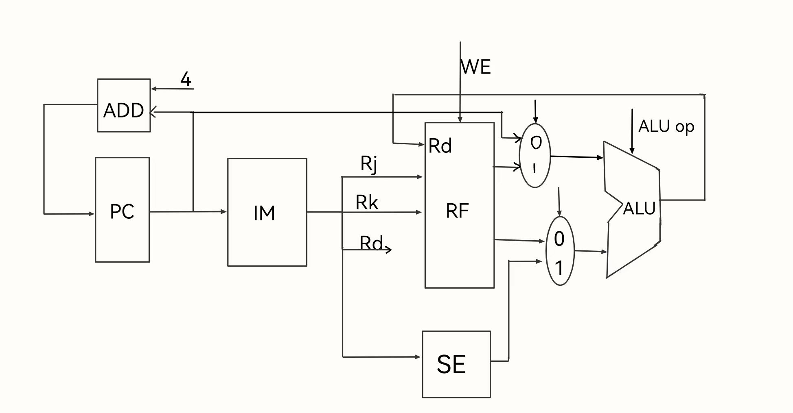
ALU指令的一般过程为：取指 --> 译码 --> 执行 --> 写回。

- 在此类指令执行阶段，如果涉及立即数，则ALU的第二个操作数为符号位扩展后的立即数，如果不涉及立即数，则ALU的第二个操作数为寄存器RK的值。
- ALU的第一个操作数一般为寄存器Rj的值，其中有一个特殊指令PCADDU12I，需要使用PC的值，两个操作数经过ALU计算后，计算结果写回到Rd寄存器里，该类周期nextPC=PC + 4。
#### 2.1.2 ld类型指令
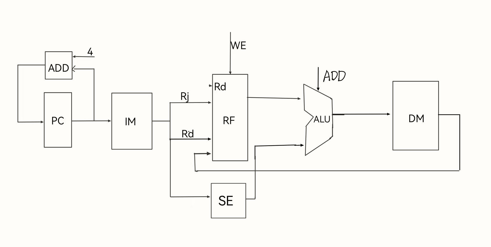
ld类型指令的状态过程为：取指 --> 译码 --> 执行 --> 访存 --> 写回

- ld类型指令有ld.b, ld.h, ld.w, ld.bu, ld.hu五种类型，以上五条指令均在执行阶段进行Rj和立即数的相加，得到待读取的地址data_sram_rdata。由于数据为32位，所以每次访存地址为data_sram_rdata[17:2]。

- 对于以上五条指令，写回阶段有所不同。ld.b读取一个字节的数据并进行符号位扩展后写入Rd。待读取字节根据地址后两位选择，后两位为2'b00表示7-0位，2'b01表示15-8位，2'b10表示23-16位，2'b11表示31-24位；
- 同理，ld.h读取半个字，地址后两位为2'b00则读取15-0位，2'b10为31-16位。
- ld.bu和ld.b不同点在于对读取数据进行零扩展，ld.hu和ld.h同理。
``` verilog
wire [1:0] ld_half_op;
wire [7:0] ld_b_data;
wire [3:0] ld_byte_op;
assign ld_half_op = data_sram_addr[1] ? 2'b10 : 2'b01;
assign ld_byte_op = data_sram_addr[0] ? (data_sram_addr[1] ? (4'b1000): (4'b0010)):
                    (data_sram_addr[1] ?(4'b0100) : (4'b0001) );
assign ld_b_data   =({8{ld_byte_op[0]}} & data_sram_rdata[ 7:0] ) |
                    ({8{ld_byte_op[1]}} & data_sram_rdata[15:8] ) |
                    ({8{ld_byte_op[2]}} & data_sram_rdata[23:16]) |
                    ({8{ld_byte_op[3]}} & data_sram_rdata[31:24]);
wire [15:0] ld_h_data ;
assign ld_h_data  = ({16{ld_half_op[1]}} & data_sram_rdata[31:16]) |
                    ({16{ld_half_op[0]}} & data_sram_rdata[15: 0]);
assign mem_result   = inst_ld_w   ? data_sram_rdata                  :
                      inst_ld_b   ? {{24{ld_b_data[7]}} ,ld_b_data}  :
                      inst_ld_h   ? {{16{ld_h_data[15]}}, ld_h_data} :
                      inst_ld_bu  ? {24'd0, ld_b_data} :
                      {16'd0, ld_h_data};
```
#### 2.1.3 st类型指令
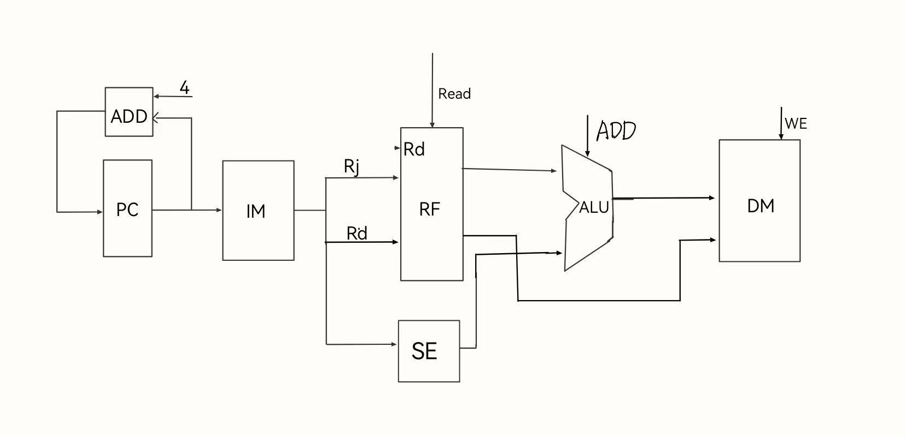
st类型指令的状态过程为 ： 取指 --> 译码 --> 执行 --> 写回

- st类型指令包括st.W，st.h，st.b 。通过rj与立即数相加得到待存储的地址data_sram_waddr，将Rd的值存入该地址中。由于数据存储器为32位编址，则传入数据存储器的地址为data_sram_waddr[17:2]。
- 对于st.b指令，存储Rd寄存器的低8位，根据data_sram_waddr低两位的值判断要存入哪个字节地址。同ld.b，后两位为2'b00表示存入7-0位，2'b01表示存入15-8位，2'b10表示存入23-16位，2'b11表示存入31-24位。同ld.h，后两位为2'b00表示存入15-0位，后两位为2'b10表示存入31-16位。
- 由于每次只能存32位数据，所以存一个字节或一个字时，需要读取原来该地址32位的数据，从而经过拼接得到新数据。
``` verilog
// st_data 为从DM读取的数据
wire [3 : 0] st_byte_op;
wire [1 : 0] st_half_op;
wire [31: 0] st_b_data ;
wire [31: 0] st_half_data ;
assign st_byte_op = ld_byte_op;
assign st_half_op = ld_half_op;
assign st_b_data   = st_byte_op[3] ? {rkd_value[7:0], st_data[23:0]}:
                     (st_byte_op[2] ? {st_data[31:24], rkd_value[7:0], st_data[15:0]} :
                     (st_byte_op[1] ? {st_data[31:16], rkd_value[7:0], st_data[7:0]} :
                     {st_data[31:8], rkd_value[7:0]}));
assign st_half_data = st_half_op[0] ? {st_data[31:16],rkd_value[15:0]}:
                     {rkd_value[15:0],st_data[15:0]};
```

#### 2.1.4 条件跳转指令
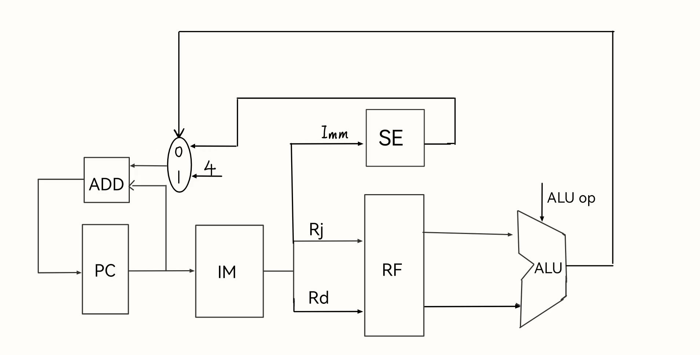
条件跳转指令的状态过程为：取指 --> 译码 --> 执行

- 对于条件跳转指令，读取Rj和Rd对应的值，并进行相应的ALU操作，如果符合条件，则PC = PC + imm，反之 PC = PC + 4。
#### 2.1.5 无条件跳转指令
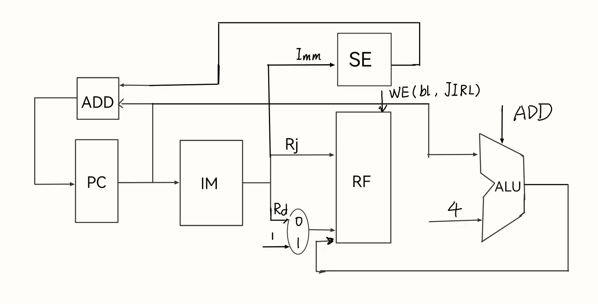
无条件跳转指令有三个 b, bl，jirl。
- 对于b指令，PC = PC + imm；
- 对于bl指令，PC = PC + imm；R1 = PC + 4;
- 对于jirl指令，PC = PC + imm；Rd = PC + 4；
所以bl和jirl有写回阶段。

### 2.2 译码模块/控制信号
#### 2.2.1 判断指令名称
使用四个译码器分别对指令31-26位，25-22位，21-20位，19-15位进行译码，通过译码结果来决定指令。例如
``` verilog
assign inst_sll_w  = op_31_26_d[6'h00] & op_25_22_d[4'h0] 
                     & op_21_20_d[2'h1] & op_19_15_d[5'h0e];
assign inst_srl_w  = op_31_26_d[6'h00] & op_25_22_d[4'h0] 
                     & op_21_20_d[2'h1] & op_19_15_d[5'h0f];
```
#### 2.2.2  判断立即数类型
不同的指令立即数的生成不同，指令中立即数的位数不同，需要根据不同的指令判断。
``` verilog
assign need_ui5   =  inst_slli_w | inst_srli_w | inst_srai_w;
assign need_si12  =  inst_addi_w | inst_ld_w | inst_st_w | inst_ld_b | inst_ld_h|
                     inst_ld_bu  | inst_st_b | inst_st_h | inst_ld_hu;
assign need_ui12  =  inst_andi | inst_ori | inst_xori;
assign need_si16  =  inst_jirl | inst_beq | inst_bne | inst_blt | inst_bge |
                     inst_bltu | inst_bgeu;
assign need_si20  =  inst_lu12i_w | inst_pcaddu12i;
assign need_si26  =  inst_b | inst_bl;
assign src2_is_4  =  inst_jirl | inst_bl;

assign imm = src2_is_4 ? 32'h4                      :
             need_si20 ? {i20[19:0], 12'b0}         :
             need_ui12 ? {20'd0, i12[11:0]}         :
             need_ui5  ? {27'd0, rk}                :
            {{20{i12[11]}}, i12[11:0]} ;
```
#### 2.2.3 ALU操作数的选择
包含立即数的指令 alu_src2为立即数，其余为寄存器的值，jirl，bl，pcaddu12i指令需要pc参与运算来得到存入RF的值，所以alu_src1为pc
控制信号等如下：
``` verilog
assign src1_is_pc    = inst_jirl | inst_bl | inst_pcaddu12i;
assign src2_is_imm   = inst_slli_w | inst_srli_w | inst_srai_w |inst_addi_w |
                        inst_ld_w   |inst_st_w   |inst_lu12i_w |inst_jirl   |
                        inst_bl     |inst_pcaddu12i |inst_slti   |inst_sltui  |
                        inst_andi   |inst_ori    |inst_xori   |inst_ld_b   |inst_ld_h   |
                        inst_ld_bu  |inst_ld_hu  |inst_st_b   |inst_st_h   ;
assign alu_src1 = src1_is_pc  ? pc[31:0] : rj_value;
assign alu_src2 = src2_is_imm ? imm : rkd_value;
```
#### 2.2.4 RF写回控制信号
- 对于st类型，条件跳转类型和b指令，不需要对RF的写回操作，所以对于这些指令，RF的写信号为false。
- 对于ld类型指令，写回数据来自DM，其余的来自ALU，所以需要对写回数据来源进行选择
``` Verilog
assign gr_we         = ~inst_st_w & ~inst_beq & ~inst_bne & ~inst_b  & ~inst_st_b &
                       ~inst_st_h & ~inst_bge & ~inst_blt & ~inst_bgeu & ~inst_bltu;
assign rf_we    = gr_we && valid;
assign res_from_mem  = inst_ld_w | inst_ld_b | inst_ld_h | inst_ld_bu | inst_ld_hu;
assign final_result = res_from_mem ? mem_result : alu_result;
```
#### 2.2.5 PC跳转信号
对于大部分指令，nextPC = PC + 4，当为跳转指令时，PC 有可能变为 PC + imm（立即数），在跳转指令时， pc可能跳转为 br_target ，设PC跳转控制信号为br_taken,则当为跳转指令且满足跳转条件时，该信号为真。
``` verilog
assign br_taken = (   (inst_beq  &&  rj_eq_rd)
                   || (inst_bne  && !rj_eq_rd)
                   || (inst_blt  &&  alu_result[0])
                   || (inst_bltu &&  alu_result[0])
                   || (inst_bge  && !alu_result[0])
                   || (inst_bgeu && !alu_result[0])
                   || inst_jirl
                   || inst_bl
                   || inst_b
                  ) && valid;
assign br_target = (inst_beq || inst_bne || inst_bl || inst_b || inst_blt || inst_bltu || inst_bge || inst_bgeu) ? (pc + br_offs) :
                                                   /*inst_jirl*/ (rj_value + jirl_offs);
assign seq_pc       = pc + 3'h4;
assign nextpc       = br_taken ? br_target : seq_pc;
```

### 2.3 排序程序的上板显示设计
#### 2.3.1 Bridge 1x2
在该模块中，按照待读取和存入的地址进行分类处理，如果地址在外设地址范围内，则读取外设对应的数据，或者将数据存入相应地址。否则，对DM进行操作。
#### 2.3.2 confreg
confreg中NUM_ADDR对应数码管的地址，SWITCH_ADDR对应开关的地址。
#### 2.3.3 利用外设编写汇编程序
**设计模式**： 对16个数据进行冒泡排序，sw7 = 1时，进行排序， sw3-sw0代表数据索引。
**设计思路**： 
- 在排序之前，进行循环，每次循环读取开关的值，并根据开关值得后四位确定数据地址，读出数据，存入数码管中， 接着读取sw7的值，判断该值是否为1，为1，则进行排序，不为一，再次进入循环。
- 排序结束后，进入死循环，每次循环中，读取开关的值，开关后四位作为地址读取数据，并存入数码管中。
  
**排序前**：
```
lu12i.w $r1, 0xbfaff     // r1 = 0xbfaff000，外设地址
addi.w $r2, $zero,0x80   // r2 = 0x80
C:
ld.w $r3, $r1, 0x60     //r3 =sw_addr
slli.w $r3, $r3, 0x2    //r3 << 2
andi $r3, $r3, 0xf     // 低四位
ld.w $r4, $r3, 0x0     // 取数据 
st.w $r4, $r1, 0x50    // 存入数码管
ld.w $r3, $r1, 0x60     // r3 = sw_addr
bltu $r3, $r2, C        // 判断是否进行排序
```
**排序后**：
```
D:
ld.w $r3, $r1, 0x60     //r3 =sw_addr
slli.w $r3, $r3, 0x2    // r3 << 2
andi $r3, $r3, 0x3f     // 取sw低4位
ld.w $r4, $r3, 0x0      // 取数据
st.w $r4, $r1, 0x50     // 存入数码管
b D
```
### 2.4  【可选】乘法指令的设计
首先设计一个有符号数的乘法器
#### 2.4.1 Booth算法
- 当进行 32 位有符号的乘法时，按照无符号乘法的原理，按位相乘会得到 32 个部分积，然后相加。故先用 booth 编码将 32 个部分积转化为 16个部分积，来优化电路。
- 根据乘数 y 中相邻三位的值对乘数 x 进行编码，x 可能被编码为 2x，x，0，-x，-2x，得到每个部分积也为 x 编码后结果移位，每个部分积相加时，都按补码进行运算，若 x 为负数，先对 x 进行取反加一的操作使之变成补码形式，于是对 x 的编码结果 2x，x 均为负数的补码，-x，-2x 为相应
正数
#### 2.4.2 华莱士树
- 保留进位加法器，对三个部分积相加，用 COUT=AB+BC+AC 计算进位，用 S=A⊕B⊕C，分别计算来减少电路延迟
- 华莱士树，不断使用保留进位加法器将 16 个待操作数不断减少至 2 个，最后使
用加法得到结果，若结果为负数，则除了符号位，对结果进行按位求反，然后
加一


#### 2.4.3 mul.w mulh.w mulh.wu
首先ALU_op需要添加三条乘法操作。
- 如果是有符号数相乘且操作数为负数，则对该操作数进行取补码操作
- 由于乘法器的设计为有符号数相乘，则如果是无符号数相乘，则取该数的30-0位。
- 对于乘法结果，如果是无符号数相乘，则运用乘法分配律的原理，（a+b）*（c+d）= ac + bc + ad + bd; 分别计算出两个操作数第31位带来的结果。
``` verilog
  wire [31:0] mul_a ;
  wire [31:0] mul_b ;
  wire [63:0] out ;

  assign mul_a = op_mul_wu ? {1'b0, alu_src1[30:0]} : 
                alu_src1[31]  ?(~alu_src1+1):alu_src1;
  assign mul_b = op_mul_wu ? {1'b0, alu_src2[30:0]} :
               alu_src2[31]?(~alu_src2 + 1): alu_src2;

  wire [63: 0] mul_u_1; // alu_src2[31] * alu_src1[30:0]
  wire [63: 0] mul_u_2; // alu_src1[31] * alu_src2[30:0]
  wire [63: 0] mul_u_3;

  assign mul_u_1 = alu_src2[31] ? (mul_a << 31) : 32'd0;
  assign mul_u_2 = alu_src1[31] ? (mul_b << 31) : 32'd0;
  assign mul_u_3 = (alu_src1[31] && alu_src2[31]) ? 64'h4000000000000000 : 64'd0;
  Multi_impro multi(
     .x(mul_a),
     .y0(mul_b),
     .out(out)
  );
  wire [63:0] multi_result;
  assign multi_result = op_mul_wu ? (mul_u_1 + mul_u_2 + mul_u_3 + out) : 
                     (alu_src1[31] ^ alu_src2[31]) ? ~out+1: out;
```
## 3 电路图
### 3.1 不包含乘法指令
#### 3.1.1 性能
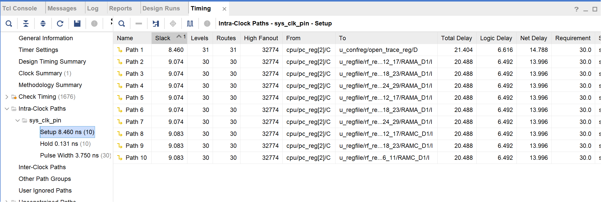
总延时约为20ns
#### 3.1.2 资源
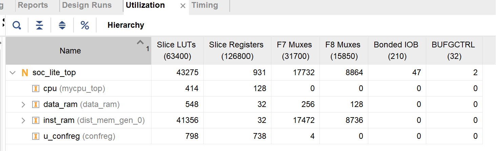
由于使用的inst_ram的depth为65536，故使用资源较多
### 3.2 包含乘法指令
#### 3.2.1 性能
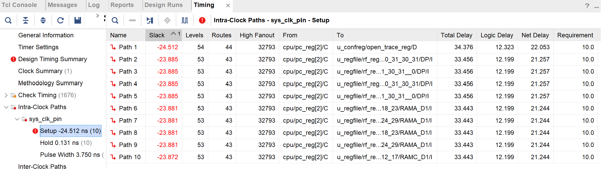
总的延时达到约35ns，相较于不包含乘法指令的CPU，延迟较高，性能较差
#### 3.2.2 资源
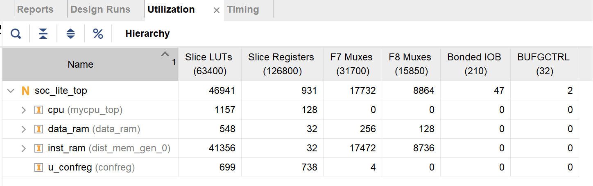
由于使用的inst_ram的depth为65536，故使用资源较多，且对比可得，乘法指令的实现耗费了较多资源
## 4 仿真结果
### 4.1 20条指令仿真

### 4.2 39条指令仿真

### 4.3 乘法指令仿真
**说明**：由于没有测试文件，所以我在包含乘法指令的测试程序中提取出了乘法指令。经我的研究思考发现，如果乘法指令结果不正确，则会跳转到inst_error部分，从而导致接下来的测试程序无法正常运行，所以只要乘法指令测试程序能一条条执行，则说明指令正确。
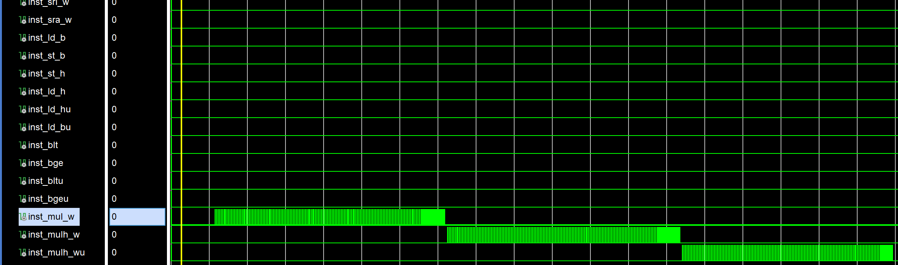
在仿真波形中，对每个乘法指令的测试程序，该乘法指令重复出现，说明程序顺序执行，没有跳转，指令正确。此外，由于没有对应的golden_trace,经过我对包含所有指令的golden_trace文件中相应乘法部分的人工比对，确定指令结果正确。
## 5 上板结果
### 5.1 20条指令测试程序
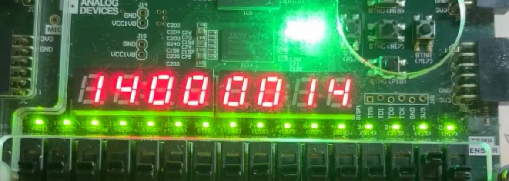
前两个数码管表示测试程序的个数，后两个数码管表示通过程序的个数。
可知测试了20条指令，通过了20条指令。
### 5.2 排序程序
此时sw7 = 0 ，未进行排序，可知前三个数依次为0， 4， 8
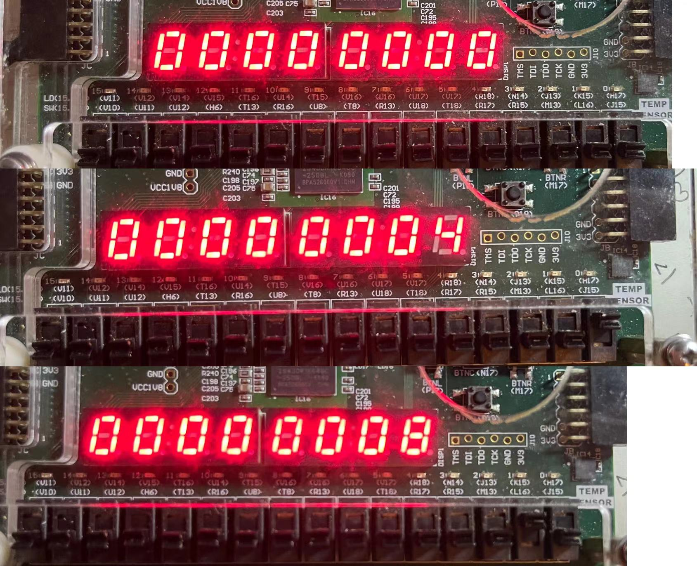

sw7 = 1 ，排序结束，根据开关索引可知，此时前三个数依次为3c，38，34
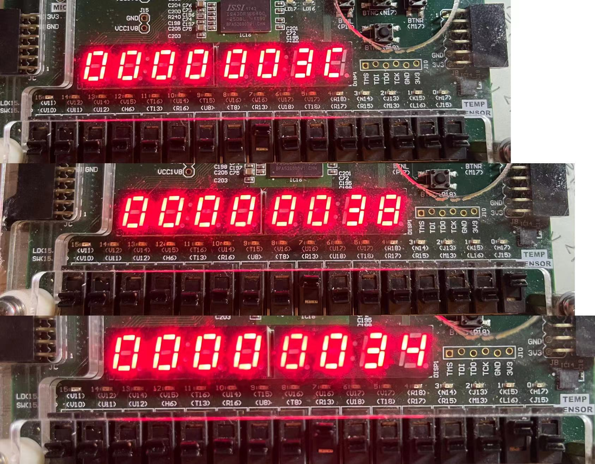

## 6 问题
1. **原有20条指令CPU的代码中的错误导致运行不正确**
   **解决方法**：先改了一些下载代码中明显的错误，如alu的两个操作数都传入的是alu_src2，接着运行，仍出现Error，找到与golden_trace比对错误的地方，发现是bl指令的问题， 重新捋一遍数据通路，发现gr_we处错误，gr_we中包含了~inst_bl，但bl指令需要写回寄存器，删去后正确。
2. **ld.h ld.b指令测试错误**
   **解决方法**: 由于不了解ld.h，ld.b指令的存储方式导致错误，最初我将所有数据都存到ld.b指令的数据都存入低8位，经过与golden_trace比较，发现第一个错误的ld.b程序，我的待写入数据的低八位和正确数据的15-8位相同，接着我发现alu计算出的地址低两位不为0，为1，于是推断出正确的存储方式。
3. **st.h st.b指令错误**
   **错误原因**：对于dram，每次时钟上升沿读出的是上个周期中的数据，对于上个周期结束时要存入的数据无法读出，而根据指令的测试程序发现，测试思路为先进行st.w指令存入一个字，接着下个周期用st.b指令存入一个字节，两个周期后，然后读出该地址的值，与正确值比较，不同则出现错误。而该st.b指令存入一个字节，其他字节的数据不变，故需要读出原来的数据，按照dram的原理，无法读出上个st.w指令存入的数据，导致错误。
   **解决方法**：使用寄存器暂时存储一下st.w指令对应的数据，地址和PC，当下个周期为st.b或者st.h指令且待存入地址的31-2位与st.w指令的相同时，把st.w指令要存的数据传给st.b指令。
