# LABH5-Cache-Report
<p align = "right" > PB22111639 马筱雅</p>

## 1 实验目的
1. 理解cache的基本原理，工作模式及设计方法
2. 设计包含指令cache的CPU，并测试其性能
## 2 逻辑设计
### 2.1 指令cache状态机设计
**设计思路**：
将指令cache分为三种状态：
- **IDLE:** 初始状态，如果有读数据请求，则状态机转为READ状态，表示从内存读数据。实际上，在IDLE状态，已经把待读地址传送到了内存中，等到READ状态时，tag和inst指令正好被读出。
<br>
- **READ:** 读状态，该状态时tag和inst被读出并进行比较，如果命中并此时仍有读请求r_req，则下一个状态仍是READ，如果未命中，则转向MISS状态，其他则转向IDLE状态
<br>
- **MISS:** 指令缺失（未命中）状态，此时向内存中传递地址和读请求，当指令被读出时，获得mem_ready信号，然后转向IDLE状态，从而使传来的数据得到缓冲，如果传来br信号，意味着CPU中有地址跳转，则此时缺失的指令位于CPU正在执行的指令之后，则不需要取该缺失指令，下个状态为READ状态，表示重新读取

**状态转换图**
  
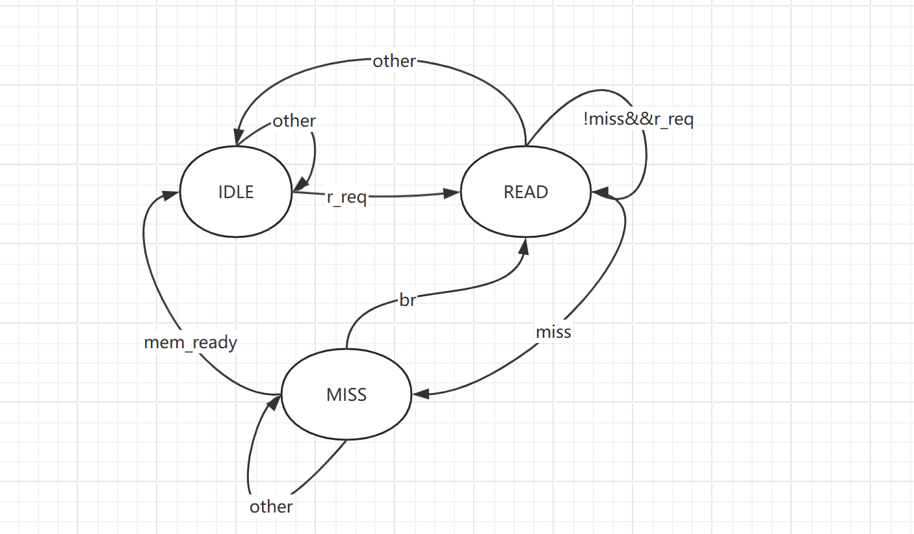
**相关代码**
```verilog
always @(posedge clk or negedge rstn) begin
    if(!rstn) begin
        cs <= IDLE;
    end
    else begin
        cs <= ns;
    end
end
always @(*) begin
        case (cs)
        IDLE: begin
            if(r_req)
                ns = READ;
            else
                ns = IDLE; 
        end 
```
```verilog   
        READ: begin
            if(miss)
                ns = MISS;
            else if(r_req)
                ns = READ;
            else
                ns = IDLE;
        end

        MISS: begin
            if(br)
                ns = READ;
            else if(mem_ready)
                ns = IDLE;
            else
                ns = MISS;
        end
            default: ns = IDLE;
        endcase
end
```
<!--  -->
<!-- 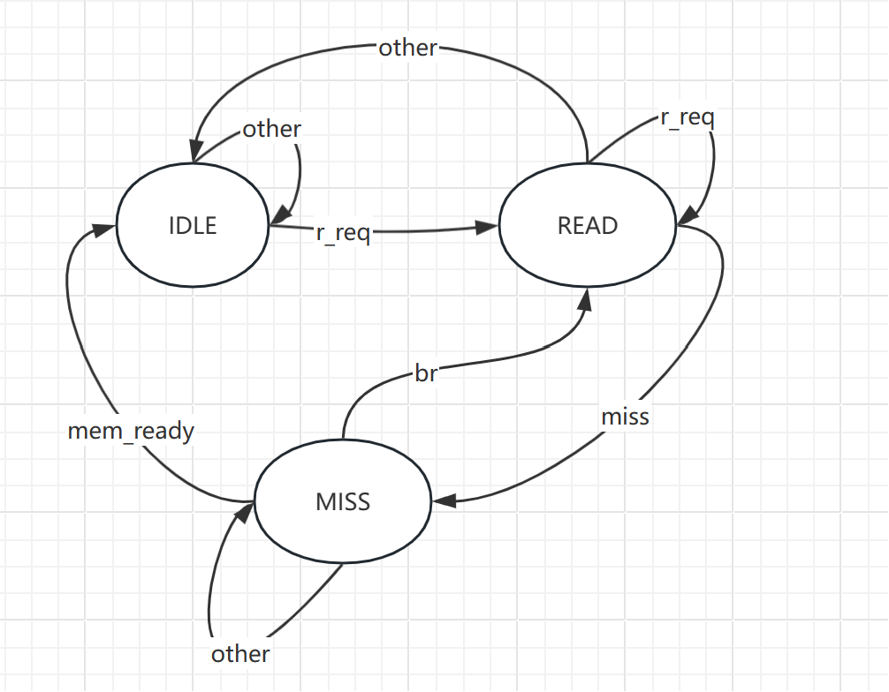 -->
### 2.2 两路组cache的设计
**设计思路：**
- 分别例化两个bram存储tag，两个bram存储数据，每个设置大小为1024，则索引index为第12到第3位，剩下第32到第13位为tag。
- 由于每次取出数据会有一个周期的延迟，所以使用nextpc作为地址，从而使得cache转为读状态时已经读出了数据，而此时的pc正好变为nextpc，指令与地址相对应。
- 如图：把nextpc作为cache的读地址，使得在状态转为READ时，cache里的数据已经被读出并进行比较。
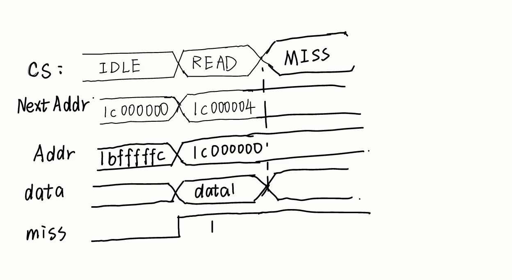

**代码如下**：
```verilog
assign  tag_index   =   next_addr[11:2];
assign  tag         =   next_addr[31:12];
```
### 2.3 cache中各信号的变化及意义
- **mem_ready:** 内存就绪信号，当从指令内存中取出指令后，mem_ready变为1。
- **r_mem:** 从内存读信号，当cache处于READ状态且未命中时，r_mem置为1，当cache处于MISS状态且!mem_ready和!br时，表示还要继续从内存读，r_mem保持1，其余情况r_mem变为0。
- **ret_buf_we:** 表示缓冲内存所读出的指令，当cache处于MISS状态且mem_ready时，ret_buf_we变为1，表示要获得从内存中读出的指令，使得到的指令信号更稳定。
- **ret_buf:** 表示从内存中读出的指令。当ret_buf_we为真时，将从内存读出的指令mem_r_data赋值给ret_buf。
- **refill:** 填充信号，表示要把从内存读来的数据写回cache，当cache由MISS状态转向IDLE状态时，该信号为1，表示写回。
- **data_from_mem:** 表示指令的来源，即是否是从内存中读出。如果refill信号为1，则data_from_mem为1，此时将得到的ret_buf指令传给CPU，一次完整的读指令操作完成。
```verilog
assign mem_addr = addr; //要读内存的地址
assign data_from_mem = (cs == IDLE && refill) ? 1'b1 : 1'b0;
assign ret_buf_we = ((cs == MISS) && mem_ready) ? 1'b1 : 1'b0;
assign miss = br ? 1'b0 : (cs == READ && hit == 2'b00) || (cs == MISS) ? 1'b1 : 1'b0;
//处理refill和ret_buf
always @(posedge clk or negedge rstn) begin
    if(!rstn) begin
        refill      <= 1'b0;
        ret_buf     <= 32'd0;
    end
    else begin
        if(ret_buf_we) begin
            ret_buf <= mem_r_data; //把从内存中读出的指令传给cache
        end
        if(cs == MISS && mem_ready) begin
            refill <= 1'b1;//表示指令准备好
        end
    end
end
always @(*) begin
    case (cs)
        IDLE: begin
            r_mem           =    1'b0;
        end 
        READ:begin
            if(hit[1] || hit[0])begin
                r_mem           =    1'b0;
            end
            else if(br)begin
                r_mem           =    1'b0;
            end
            else r_mem = 1'b1;//表示miss未命中，需要从内存读
                
        end
        MISS:begin
            if(mem_ready || br) begin
                r_mem           =    1'b0;
            end
            else begin   
                r_mem           =    1'b1; //表示读完成   
            end
        end
        default: begin  
           r_mem = 1'b0;
        end 
    endcase
end
//指令来源
assign  r_data = data_from_mem ? ret_buf : 
                ((cs == READ) && hit[1]  ? cache_rdata_1: 
                (cs == READ) && hit[0] ? cache_rdata_2 : 32'd0);
```

### 2.4 LRU策略的实现
1. 例化两个一位history_bram代表两路cache的使用状况，两个bram相同地址只能有一个存储1，如果第一个history_bram存储的是1，代表最近使用的是第一个bram，反之则为第二个。
2. 当cache命中时，history_bram存的值相应变化，并使写使能。当未命中时，根据history_bram的值判断要存入哪一路cache，并把要存入路数的cache对应的history_bram写回1，另一路对应的写回0。
3. **具体代码实现**：
   - hit表示命中情况，used表示要写回的值，tag_we表示两路cache写回情况。
   - 如果hit[1]和hit[0]分别对应第一、二路命中情况，若命中，则used相应位置为1，如果未命中，则当根据tag_we_1与tag_we_2判断将写入哪一路cache，相应的used位置为1，表示最近使用。
   - used_we表示history_bram写使能，当used中有一位为1，即表示有命中情况或者写回cache情况，则需要改变history_bram的值，所以此时写使能为真。
``` verilog
assign  hit   =  {valid_1 && (r_tag_1 == tag), valid_2 && (r_tag_2 == tag)};
assign used[1] = (hit[1] && (cs == READ)) || (tag_we_1 &&(cs == MISS)) ? 1'b1 : 1'b0;
assign used[0] = (hit[0] && (cs == READ)) || (tag_we_2 &&(cs == MISS)) ? 1'b1 : 1'b0;
assign used_we[1] = used[1] || used[0];
assign used_we[0] = used[1] || used[0];
```
## 3 电路性能
### 3.1 电路图
#### 3.1.1 主要模块连接图
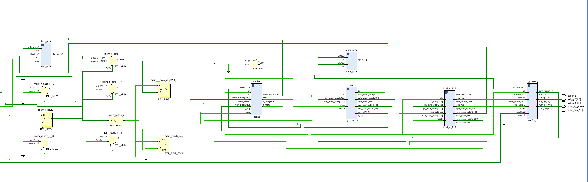
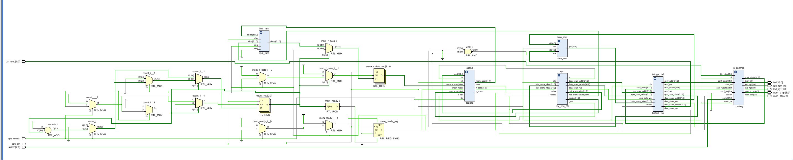
#### 3.1.2 cache部分电路图
### 3.2 电路资源使用图
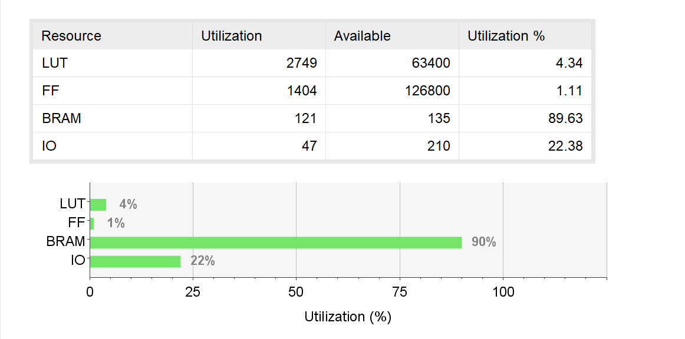
### 3.3 时钟

右下图可知，设置的时钟周期为10ns，建立电路延迟约16ns
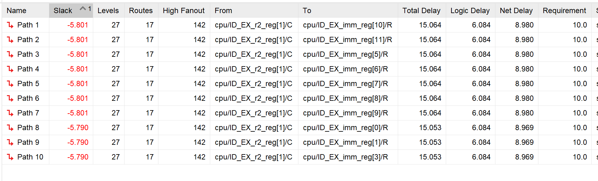
在电路hold时，约有10ns的延迟
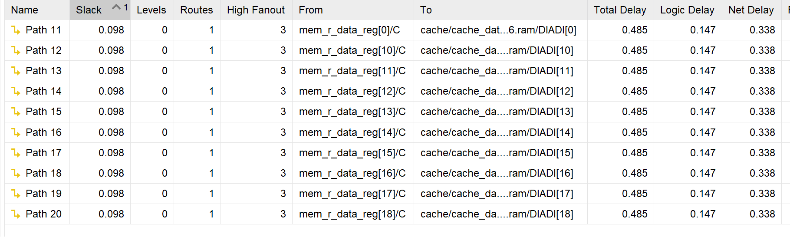
## 4 仿真结果
### 4.1 39条指令仿真结果
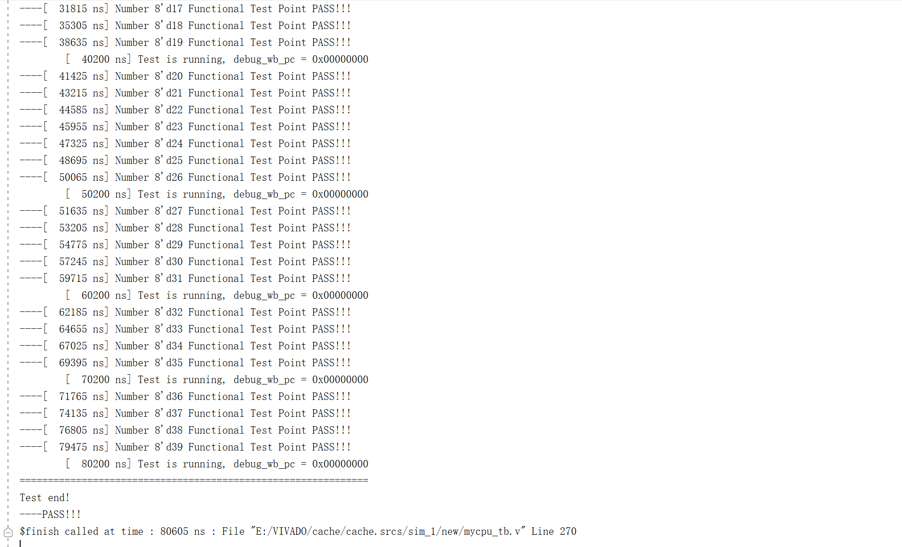
### 4.2 波形图仿真结果说明
- 从黄色竖直线处开始，此时状态为IDLE（0），在cs变为READ（1）时，读出cache的值（r_tag_1,r_tag_2,cache_rdata_1,cache_rdata_2）
- 此时未命中，miss变为1，r_mem变为1，表示要向内存读数据，当mem_ready时表示读出数据，r_mem变为0，表示不再需要读数据，此时ret_buf_we变为1，方便下个周期传递数据
- 下个状态为IDLE，miss变为0，并把数据存入cache，此时相应的tag_we变为1，used_we变为1，表示要进行最近使用块的更新。
- 由于在IDLE状态访问cache的地址是nextaddr，则在进入read状态时数据已经被取出，重复上述过程。
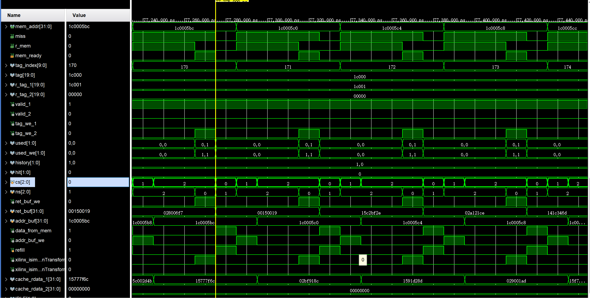
## 5 上板结果
数字以16进制表示，上板图表示测试了27H（39）条指令，通过了27H（39）条指令

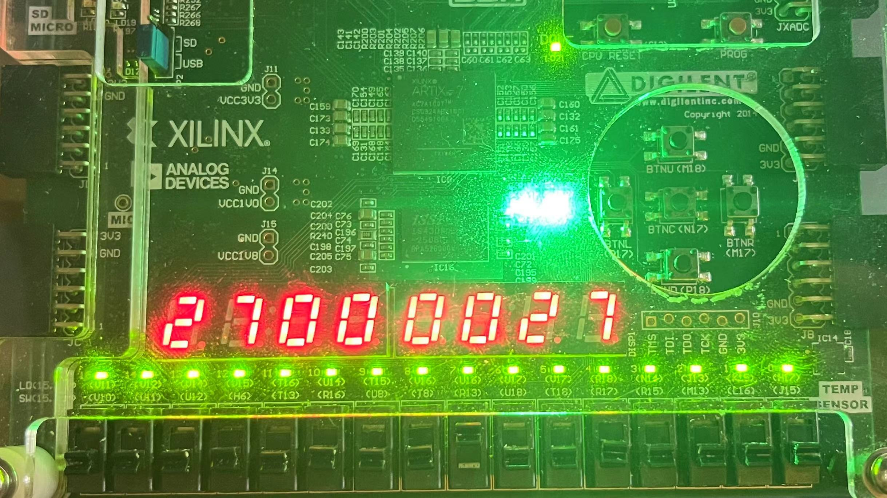
## 6 遇到的问题
1. **问题**：**仿真过程中，仿真到某一点，仿真停滞**
   **解决方法**：经查阅资料，可能是因为在逻辑电路always@(*)中的信号变化反过来作用于逻辑电路，从而造成死循环，把相应信号分开开后发现不是该原因。经观察波形图，发现按照最初的设计，cache向cpu传递miss信号，由于miss信号产生有一定的延迟，所以会使nextpc在时钟上升沿变化后又因为miss信号改变，从而在很短的时间呢nextpc多次变化，从而导致电路不稳定，仿真停滞。于是改变miss信号在cpu中的作用位置，miss信号不直接改变nextpc，而是影响流水线cpu中不同阶段指令的传递，从而使nextpc信号稳定，该问题得到解决。
## 7 附录（代码）
### Icache
```verilog
module Icache (
    input            wire               clk,
    input            wire               rstn,
    input            wire               r_req,
    input            wire               br,
    input            wire               mem_ready,
    input      wire     [31:0]          addr,
    input      wire     [31:0]          next_addr,
    input      wire     [31:0]          mem_r_data,
    output     wire     [31:0]          r_data,
    output      wire [31:0]          mem_addr,
    output        wire                  miss,
    output        reg                  r_mem
);
//用next_addr计算出tag_index和tag
wire    [9:0]    tag_index;
// reg     [9:0]    w_tag_index;
wire    [19:0]   tag;
assign  tag_index   =   next_addr[11:2];
assign  tag         =   next_addr[31:12];
```

```verilog
// 读出tag里的数据，一位valid???20位tag
wire    [19:0]      r_tag_1;
wire    [19:0]      r_tag_2;
wire                valid_1;  
wire                valid_2;  
wire                 tag_we_1;
wire                 tag_we_2;
wire                 valid_w1;
wire                 valid_w2;

//a代表写，b代表读
cache_tag_1 cache_tag_1(
    .clka (clk               ),
    .clkb (clk               ),
    .enb  (r_req             ),
    .ena  (r_req             ),
    .web(0),
    .wea  ( tag_we_1    ),
    .addrb(tag_index         ),
    .addra(addr_buf[11:2]),
    .dina ({valid_w1, addr_buf[31:12]}),
    .doutb({valid_1, r_tag_1})
);
cache_tag_2 cache_tag_2(
    .clka (clk               ),
    .clkb (clk               ),
    .enb  (r_req             ),
    .ena  (r_req             ),
    .wea  (tag_we_2     ),
    .web  (0     ),
    .addrb(tag_index         ),
    .addra(addr_buf[11:2]),
    .dina ({valid_w2, addr_buf[31:12]}),
    .doutb({valid_2, r_tag_2})
);
wire used[1:0];
wire used_we[1:0];
wire history[1:0];
history_bram used_1(
    .clka (clk               ),
    .clkb (clk               ),
    .ena  (r_req             ),
    .enb  (r_req             ),
    .wea  (used_we[1]   ),
    .web  (0   ),
    .addrb(tag_index         ),
    .addra(addr_buf[11:2]         ),
    .dina (used[1]),
    .dinb (),
    .doutb(history[1]),
    .douta()
);
history_bram used_2(
    .clka (clk               ),
    .clkb (clk               ),
    .ena  (r_req             ),
    .enb  (r_req             ),
    .wea  (used_we[0]   ),
    .web  (0   ),
    .addrb(tag_index         ),
    .addra(addr_buf[11:2]        ),
    .dina (used[0]),
    .dinb (),
    .doutb(history[0]),
    .douta()
);
// 判断是否命中, hit[1] 表示cache_1, hit[0] 表示cache_2 
wire    [1:0]       hit;

assign  hit   =  {valid_1 && (r_tag_1 == tag), valid_2 && (r_tag_2 == tag)};
assign used[1] = (hit[1] && (cs == READ)) || (tag_we_1 &&(cs == MISS)) ? 1'b1 : 1'b0;
assign used[0] = (hit[0] && (cs == READ)) || (tag_we_2 &&(cs == MISS)) ? 1'b1 : 1'b0;
assign used_we[1] = used[1] || used[0];
assign used_we[0] = used[1] || used[0];
//设置状???机
localparam  IDLE = 2'b00;
localparam  READ = 2'b01;
localparam  MISS = 2'b10;
reg       [2:0]     cs;
reg       [2:0]     ns;
always @(posedge clk or negedge rstn) begin
    if(!rstn) begin
        cs <= IDLE;
    end
    else begin
        cs <= ns;
    end
end
always @(*) begin
        case (cs)
        IDLE: begin
            if(r_req)
                ns = READ;
            else
                ns = IDLE; 
        end 
        READ: begin
            if(miss)
                ns = MISS;
            else if(r_req)
                ns = READ;
            else
                ns = IDLE;
        end
        MISS: begin
            if(br)
                ns = READ;
            else if(mem_ready)
                ns = IDLE;
            else
                ns = MISS;
        end
            default: ns = IDLE;
        endcase
end

// 处理信号
reg         valid_buf_1;
reg         valid_buf_2;

wire         ret_buf_we;  //返回值缓冲使???
reg [31:0]  ret_buf;
reg [31:0]  addr_buf;
wire         addr_buf_we; // 地址缓冲使能
wire         data_from_mem; //从内存读取数据，数据准备???
reg  refill;  //是否??????
assign miss = br ? 1'b0 : (cs == READ && hit == 2'b00) || (cs == MISS) ? 1'b1 : 1'b0;
assign addr_buf_we = (cs == READ && hit == 2'b00) ? 1'b1 : 1'b0;
always @(*) begin
    case (cs)
        IDLE: begin
            r_mem           =    1'b0;
        end 
        READ:begin
            if(hit[1] || hit[0])begin
                r_mem           =    1'b0;
            end
            else if(br)begin
                r_mem           =    1'b0;
            end
            else r_mem = 1'b1;
                
        end
        MISS:begin
            if(mem_ready || br) begin
                r_mem           =    1'b0;
            end
            else begin   
                r_mem           =    1'b1;       
            end
        end
        default: begin  
           r_mem = 1'b0;
        end 
    endcase
end
assign mem_addr = addr;
assign data_from_mem = (cs == IDLE && refill) ? 1'b1 : 1'b0;
assign ret_buf_we = ((cs == MISS) && mem_ready) ? 1'b1 : 1'b0;
assign tag_we_1 = ((cs == MISS) && mem_ready) ? (valid_buf_1 ?
                  (valid_buf_2 ? (history[1] ? 1'b0 : 1'b1) : 1'b0) : 1'b1) : 1'b0;
assign tag_we_2 = ((cs == MISS) && mem_ready) ? (valid_buf_1 ? 
                  (valid_buf_2 ? (history[1] ? 1'b1 : 1'b0) : 1'b1) : 1'b0) : 1'b0;
assign valid_w1 = 1'b1;
assign valid_w2 = valid_buf_1 ? 1'b1 : 1'b0;
always @(posedge clk or negedge rstn) begin
    if(!rstn) begin
        refill      <= 1'b0;
        ret_buf     <= 32'd0;
        valid_buf_1 <= 1'b0;
        valid_buf_2 <= 1'b0;
        addr_buf    <= 32'd0;
    end
    else begin
        if(ret_buf_we) begin
            ret_buf <= mem_r_data;
        end
        if(cs == MISS && mem_ready) begin
            refill <= 1'b1;
        end
        if(cs == IDLE) begin
            refill <= 1'b0;
            valid_buf_1 <= valid_1;
            valid_buf_2 <= valid_2;
        end
        else if(cs == READ) begin
            valid_buf_1 <= valid_1;
            valid_buf_2 <= valid_2;
        end
        if(addr_buf_we) begin
            addr_buf <= addr;
        end
        
    end
end

wire [31:0] cache_rdata_1 ;
wire [31:0] cache_rdata_2 ;
assign  r_data = data_from_mem ? ret_buf : 
                ((cs == READ) && hit[1]  ? cache_rdata_1: 
                (cs == READ) && hit[0] ? cache_rdata_2 : 32'd0);
cache_data_1 cache_data_1(
    .clka  (clk            ),   
    .clkb  (clk            ),   
    .ena   (r_req    ),
    .enb   (r_req    ),
    .wea   (tag_we_1     ),    
    .web   (0     ),    
    .addra (addr_buf[11:2]              ),   
    .addrb (tag_index               ),   
    .dina  (mem_r_data    ),   
    .dinb  (    ),   
    .douta (     )   , 
    .doutb (cache_rdata_1     )    
);
cache_data_2 cache_data_2(
    .clka  (clk            ),   
    .clkb  (clk            ),   
    .ena   (  r_req     ),
    .enb   (  r_req     ),
    .wea   (  tag_we_2   ),   
    .web  ( 0   ),   
    .addra (addr_buf[11:2]             ),   
    .addrb (tag_index               ),   
    .dina  (  mem_r_data   ),   
    .dinb  (    ),   
    .douta (     )    ,
    .doutb (cache_rdata_2     )    
);
endmodule
```