# LAB1 实验报告
    　　　　　　　　　　　　　　　　　　　　 PB22111639 马筱雅
### 1 　实验目的
1. 学习ALU，RF，存储器的实现思路并掌握其功能、时序及其应用
2. 利用状态机的思想，采用单端口存储器和ALU实现冒泡排序
3. 学会使用ip核生成存储器，并比较分布式和块式存储器的特性

### 2　逻辑设计
#### 2.1  ALU和RF设计
##### 2.1.1 ALU
ALU要求实现加减，有符号比较，无符号数比较，与，或，或非，异或，左移，逻辑右移，算术右移，赋值等功能。则对除有符号比较外的操作均可直接运用相应符号处理。对于有符号数比较，可以应用强制类型转换，如图所示
```  verilog
    wire signed [31:0] su0, su1;
    assign su0 = src0;
    assign su1 = src1;
    always @(*) begin
        case (op)
            4'd0: res = src0 + src1; 
            4'd1: res = src0 - src1; 
            4'd2: res = su0 < su1;
            4'd3: res = src0 < src1; 
            4'd4: res = src0 & src1; 
            4'd5: res = src0 | src1; 
            4'd6: res = ~(src0 | src1); 
            4'd7: res = src0 ^ src1; 
            4'd8: res = src0 << src1[4:0]; 
            4'd9: res = src0 >> src1[4:0]; 
            4'd10: res = src0 >>> src1[4:0]; 
            4'd11: res = src1; 
            default: res = 0;
        endcase
    end
```
##### 2.1.2 RF
RF为写优先且不改变R0的值，先定义32个32位的寄存器，如果写使能为真且待读取寄存器和待写入寄存器相同，则读出的值为待写入值，其余情况，输出值为寄存器原有值，从而实现写优先。在时钟上升沿，只有写使能为真且待写入寄存器不为R0，才能执行赋值操作，从而不改变R0的值。
``` verilog
    assign rd0 = (wa == ra0 && we) ? wd : rf[ra0];
    assign rd1 = (wa == ra1 && we) ? wd : rf[ra1];
    always @(posedge clk) begin
        if(we && wa != 0)
            rf[wa] <= wd;
    end
```
#### 2.2 DRAM 和 BRAM的设计和实现
方法：使用ip核的方式例化，并使用coe文件进行初始化
#### 2.3 冒泡排序的设计
##### 2.3.1 逻辑解释
- 冒泡排序模块使用单端口存储器，每次只能读出一个数据，则定义data0为读出的数据，data3表示要存储的数据，用src0和src1分别表示每次进行比较的两个数据，同时作为ALU的两个操作数，point表示指针，即在DRAM中取数据的位置，ps表示每次循环终止时的指针位置。
<br/>
- point初始化为0，ps初始化为1023，当一次循环初始时，src0 <= data0, 表示读出的第一个数据，同时point+1，表示准备取出下一个数据，在下一个周期，src1 <= data0, 然后src1和src0进行比较，对比较结果是否满足顺序要求进行分类。
 <br/>
- 如果不满足，则写使能we变为真，令point-1，表示要改变第一个索引对应的值，data3 <= src1，存储第一个值；在下一个周期, point + 1，data3 <= src0，存储第二个值，存储结束后写使能we变为0，如果point!=ps，则point+1，表示继续取下一个数据进行比较，如果相等，则表示此次循环结束，则point变为0，ps-1，然后进行下一次循环。
  <br/>
- 如果src0和src1满足顺序要求，则当point!=ps时，把src1赋值给src0，上一次比较中的第二个数据成为下一次比较中的第一个数据，当point==ps时，point变为0，ps-1表示此次循环结束，进行下一次循环。
``` verilog
 if(!done) begin
      case (current_state)
        s0: begin
          point <= point + 1;
          if(ps == 0) point <= 0;  //表示排序结束，索引指针归零
        end
        s1:;
        s2: begin
          if((!res[0] && up)||(res[0] && !up)) begin //得出大小比较的结论，来判断是否需要写入
            we <= 1;
            point <= point - 1;               //表示要写入第一个数据
            data3 <= src1;                    //data3表示目标数据
          end
          else begin
            if(point == ps) begin               //本次循环结束
              ps <= ps - 1;                   // ps - 1
              point <= 0;                     // point从0开始
            end
            else point <= point + 1;           //否则继续下一个数据
          end
        end
        s3: begin
          point <= point + 1;                 //存下一个数据
          data3 <= src0;
        end
        s4: begin
            we <= 0;                     //s4之后存完，we变为0
           if(point == ps) begin         //判断本次循环是否结束
                ps <= ps - 1;
                point <= 0;
            end
          else point <= point + 1;
        end 
        default:;
      endcase
```
冒泡排序结束标志done：当启动排序时done<=0，当ps变为0时表示循环结束，done<=1
```  verilog
  always @(posedge clk)
  begin
    if(!rstn)
      done <= 1;
    else if(start)
      done <= 0;
    else if(ps == 0 && we == 0)
      done <= 1;
  end
```
##### **2.3.2  状态机的设计** 
**s0：** 一次循环初始，此时指针point = 0，取第一个数据src0，而后point + 1，取下一数据
**s1：** 取第二个数据，即src1
**s2：** 判断src0和src1的大小是否符合升序/降序，从而进行状态转换
**s3：** 存储第一个数据
**s4：** 存储第二个数据
**s5：** 保持数据不变
**s6：** src0 <= src1，从而比较下一组相邻数据 
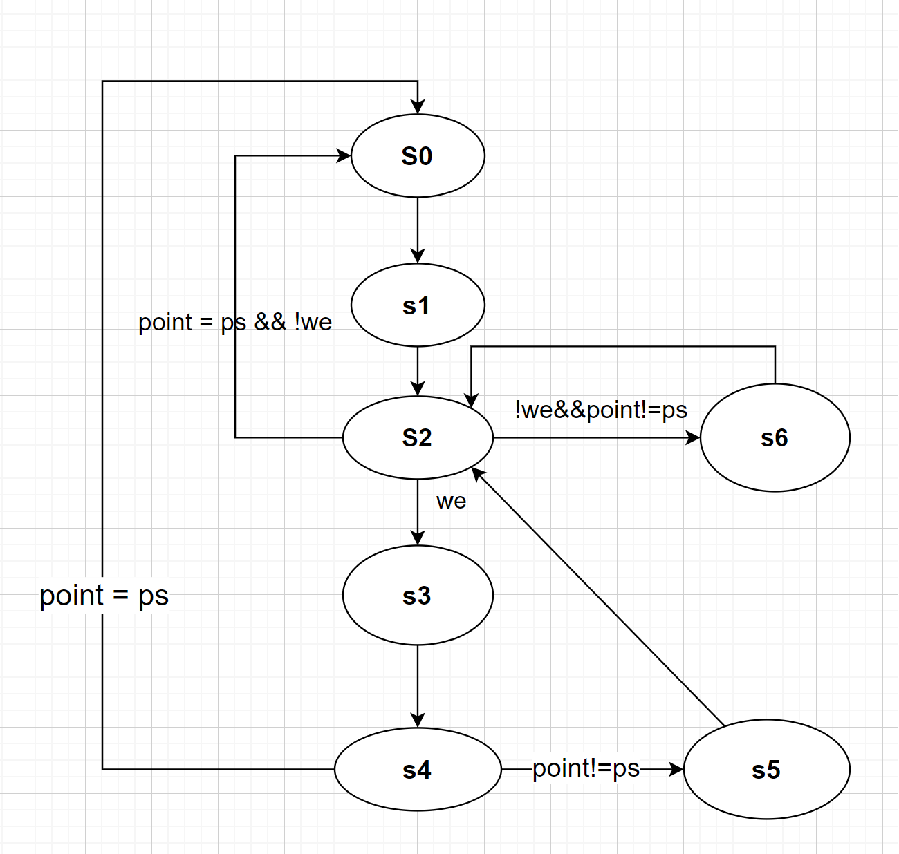

### 3 电路图
#### 3.1 ALU 和 RF
##### 3.1.1 RTL电路图
<!-- 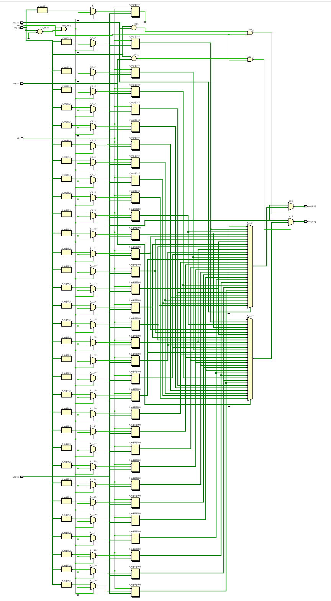 -->


**资源使用量**
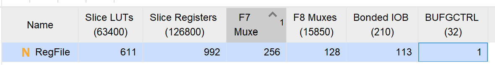
##### 3.1.2 ALU 电路图
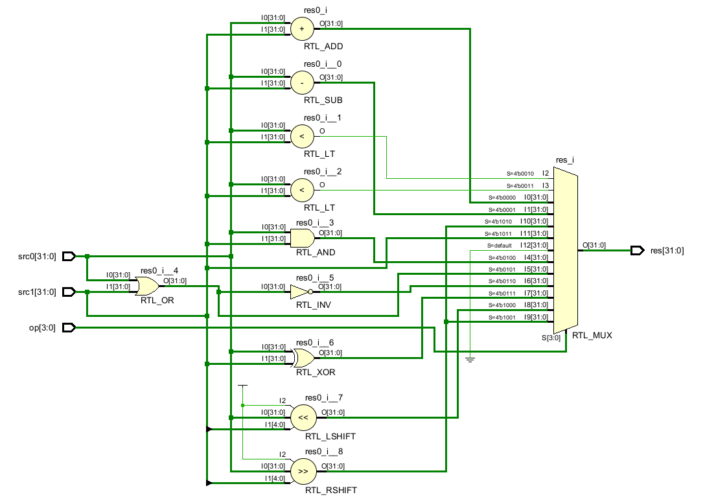
**ALU资源使用量**
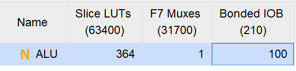
#### 3.2 DRAM 和 BRAM
##### 3.2.1 BRAM 资源使用量
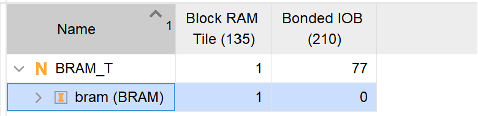
##### 3.2.2 DRAM 资源使用量
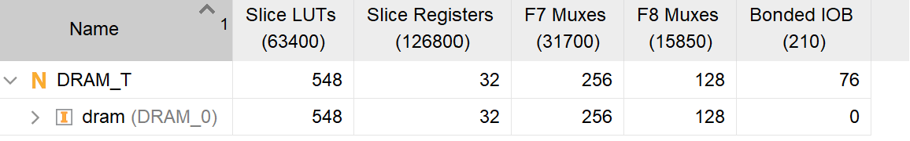
#### 3.3 SRT
**电路图**
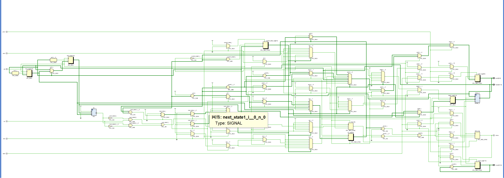
**资源使用量**
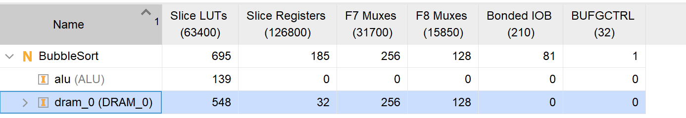
### 4 仿真结果和分析
#### 4.1 ALU 和 RF
- 对ALU和RF进行同步仿真，仿真波形图中，src0和src1为ALU的两个操作数，op为操作码，res为运行结果，由图可知，运行结果符合定义运算
- RF两个读端口为ra0，ra1，读出数据端口为rd0，rd1，写入数据为wd，写使能为we，写入地址为wa。
- 由波形图，可知we = 1，此时wa=3，ra0为3，wd=0000ffff，由于写优先，所以此时读出rd0 = 0000ffff，当wd改变为00008000时，rd0同时改变。当wa=4，ra1=4时，此时wd = 00008000，则rd1也为00008000，体现了写优先。
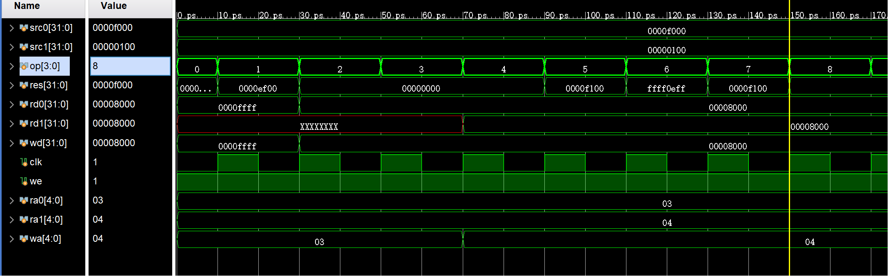
#### 4.2 DRAM 和 BRAM 

- 对BRAM和DRAM在同一个仿真文件中进行仿真，其中addr是bram的取数地址，res为取出的数据，data0为写入数据，we为bram和dram的写入信号，a，d，spo分别为darm的地址，写入数据，所取数据。每个周期a和addr均加1。
- 根据仿真波形可以看出，bram相对于dram有较大的延迟，dram在给出取数地址时即可取出数据，但bram需要时钟才能读出数据
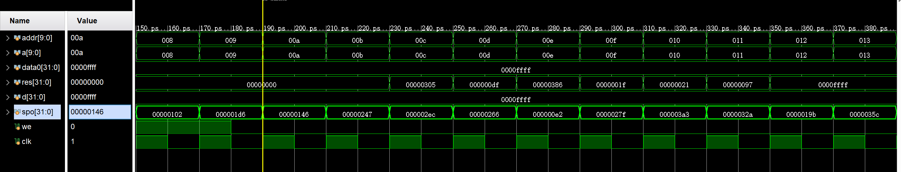
#### 4.3 SRT仿真测试
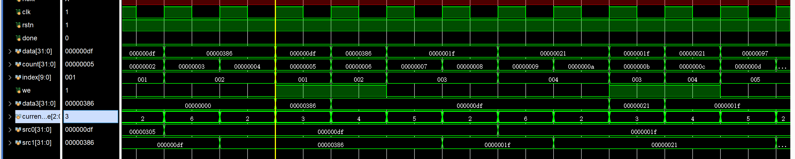
- 解析仿真图：index为指针，在current_state为6时，说明 上一次比较的两个数不需要交换，则此时src0 <=src1，src0为000000df，当index=1时，读出数据为data，src1<=data,此时src1为00000386，比较两个数据，需要交换，于是下周期we = 1，data3 = src1，index - 1，进行存储src1，接着point +1存储src0，存储完毕we变为0，index + 1，接下来进行下一次比较。运行结果符合预期。
### 5 上板结果
coe文件数据为随机排列的0-1023，用sw1=1表示升序，否则为降序；led9-led0为index索引
- 未排序时
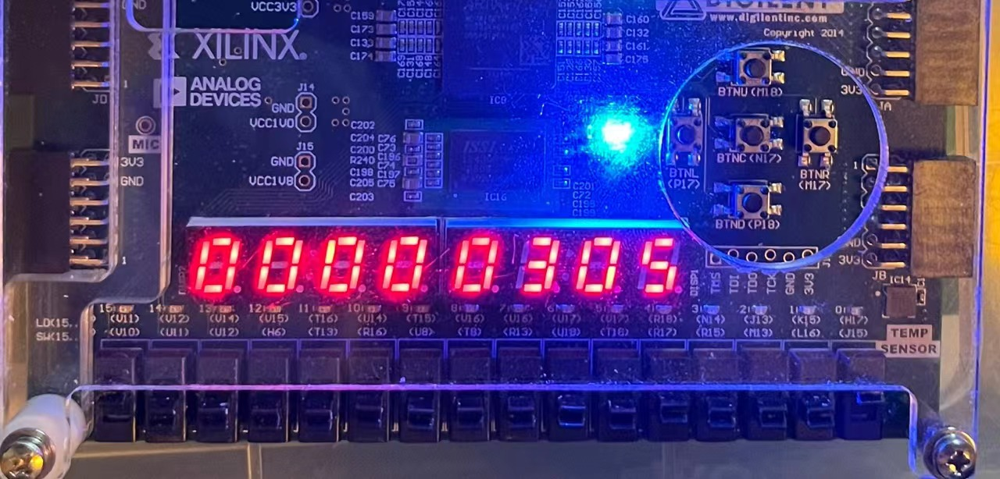
- 升序排列时
- 索引为0
  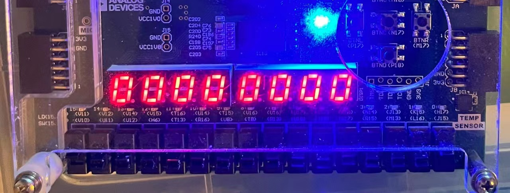
- 索引为1
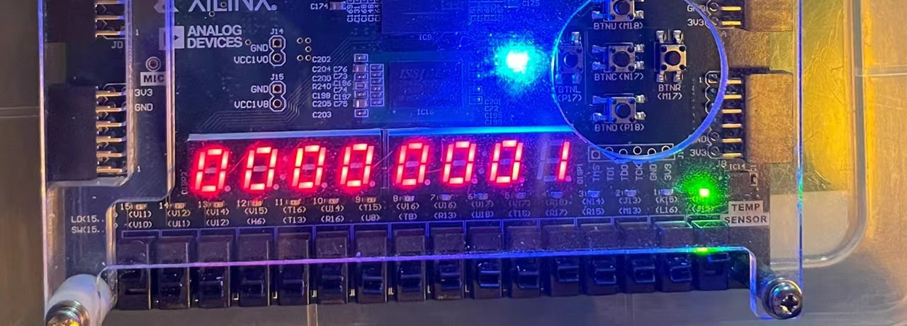
- 降序排列时
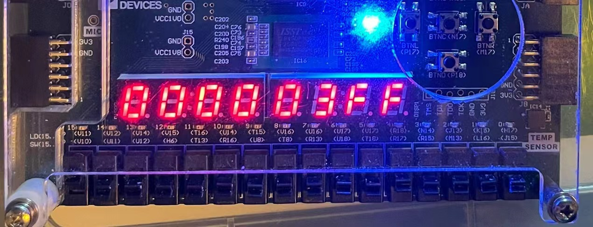
- 周期数
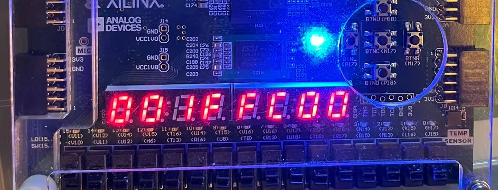
### 遇到的问题
1. index的问题，上板运行后，每次重新进行排序会导致少一个数据
   **原因**：如果index不为0，由于index是指针，每次重新排序时取出索引为index的数据，导致索引小于index的数据未参加排序。
   **解决方法**：在每次重新排序，即按下enter键时，令index为0.
2. dram的问题，we和数据转移的状态不对，还有状态机设置不合理，中间尝试去除s0和s5状态，发现出错。
   **原因**：忽略了dram取数的特性，dram取数不依赖时钟上升沿，导致每次在时钟上升沿时当前状态分别为s1和s2时取第一个和第二个操作数的时间晚，从而使得we晚了一个周期，存的数字不对。
   **解决方法**：在next_state分别为s1和s2时，赋值第一个和第二个数据，并保留状态数为s0-s6