# LABH4--流水线CPU--Report
## 1 实验目的
1. 理解流水线CPU的工作原理及工作过程
2. 实现龙芯架构的五级流水线CPU，解决CPU中结构冲突，数据冲突等问题
3. 利用实现的五级流水线CPU运行冒泡排序
## 2 逻辑设计
### 2.1 数据通路的设计
五级流水线CPU包括取指令、译码、执行、访存、写回五个阶段，其中每个周期取出一条指令，因此在每个阶段产生的信号需要用寄存器保存，从而在下一阶段能够被应用。
**不考虑相关的数据通路如下**
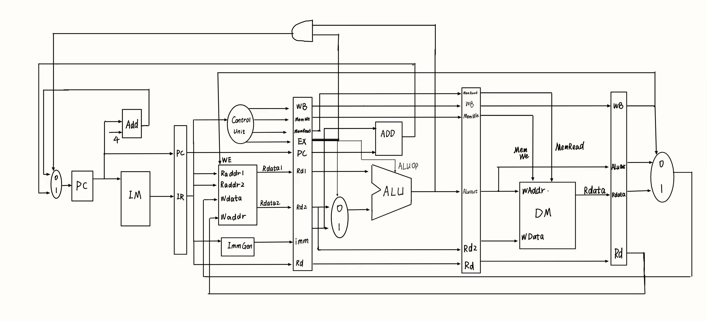
### 2.2 结构相关的处理
结构相关主要指指令存储器和数据存储器的冲突，所以将指令存储器与数据存储器分开，即可解决该问题。
### 2.3 数据相关的处理
数据相关的产生主要是因为上一条指令的目标寄存器是下一条指令的源寄存器，在目标寄存器还未写回时，下一条指令需要使用该寄存器的值，从而产生数据相关。
下面为几种数据相关类型及处理方法
- 如下图所示，在该指令序列中，第一条sub指令的结果要运用到第二条add指令中，于是产生了冲突。在sub指令中，于EXE阶段产生的结果要传递给add指令的EXE阶段，于是数据需要从EXE_MEM阶段直接传送到ID_EXE阶段，此为数据相关的一种处理方式。

- 此外，在第三条or指令阶段仍需使用X2寄存器，此时sub指令x2寄存器的值尚未写回，所以需要将数据从sub指令的MEM_WB阶段直接传送到or指令的ID_EXE阶段，将MEM_WB阶段的数据传送到其他指令的ID_EXE阶段也是处理数据冲突的方式。
- 第四条指令add同样需要使用x2寄存器，在时间CC5阶段读出x2寄存器的值，由于寄存器写的特性，此时sub指令的结果尚未写入x2，所以add指令读出的数据不正确，所以仍需要进行数据前递。在WB阶段结束后一个周期，把WB阶段写回的数据传递给下面指令的EXE阶段，来解决此数据冲突。

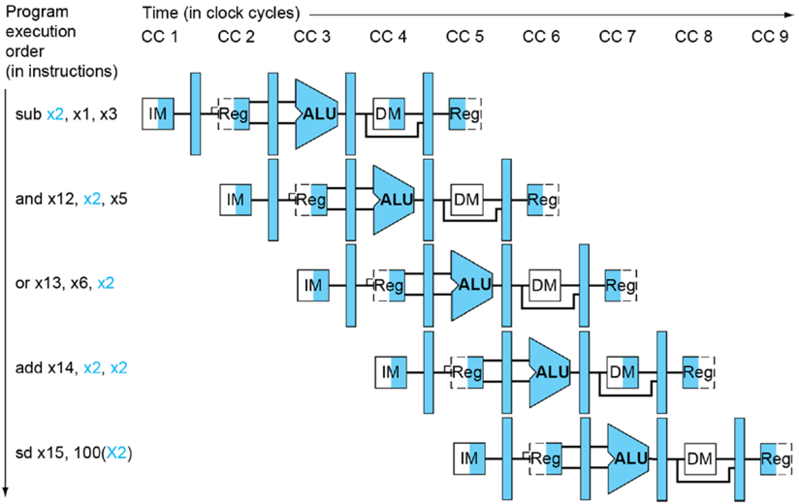
- 如下图所示，在sw指令写入的地址和下一条ld指令读的地址相同，sw指令在WB阶段结束时写入，而根据dram的特性，此时ld指令读出数据，可知读出的是未写入前的数据，所以需要将此时写入的数据传送给ld指令。

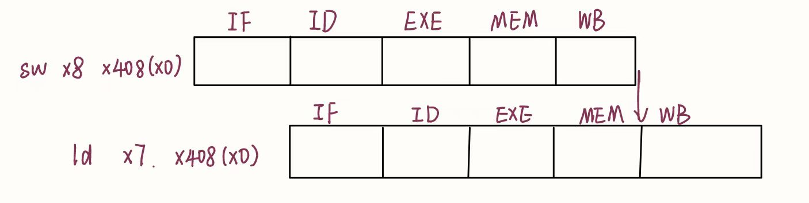
总的数据通路如下
- **ld指令的处理**
如图所示，lw指令目标寄存器为X7，addi指令需要使用X7，lw指令于CC4-CC5时取出X7的值，而若addi指令与lw指令相差一个周期执行，则该addi指令于CC3-CC4时需要使用X7，此时X7数据尚未得到，产生错误，所以lw指令后一个周期需要执行空操作。

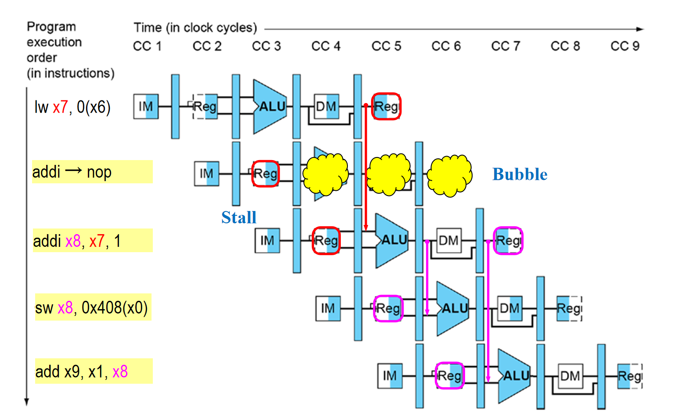
**总的数据通路如下**
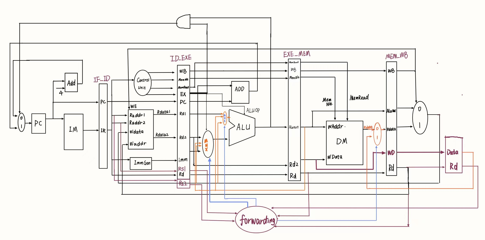
设置`forwarding`模块，当`ID_EXE`阶段的`RS1`或者`RS2`和`EX_MEM`阶段的`Rd`相同时，前递信号`EX_MEM_forward_op_rj/EX_MEM_forward_op_rk`为真，当`ID_EXE`阶段的`RS1`或者`RS2`和`MEM_WB`阶段的Rd相同时，前递信号`MEM_WB_forward_op_rj/MEM_WB_forward_op_rk`为真，当`WB`写回阶段过渡到取值阶段时，使用寄存器保存结果，若此时的`Rd`等于`ID_EXE`阶段的`RS1`或者`RS2`,则`ID_EX_forward_op_rj\ID_EX_forward_op_rk`信号为真。根据这些信号进行ALU操作数的选择。
**代码实现如下**

``` verilog
wire EX_MEM_forward_op_rj;
wire EX_MEM_forward_op_rk;

wire MEM_WB_forward_op_rj;
wire MEM_WB_forward_op_rk;

wire ID_EX_forward_op_rj;
wire ID_EX_forward_op_rk;

// wire ST_LD;

assign ID_EX_forward_op_rj  = (WB_rd == ID_EX_r1)      ? 1'b1 : 1'b0;
assign ID_EX_forward_op_rk  = (WB_rd == ID_EX_r2)      ? 1'b1 : 1'b0;
assign EX_MEM_forward_op_rj = (ID_EX_r1 == EX_MEM_rd ) ? 1'b1 : 1'b0;      
assign EX_MEM_forward_op_rk = (ID_EX_r2 == EX_MEM_rd ) ? 1'b1 : 1'b0;
assign MEM_WB_forward_op_rj = (ID_EX_r1 == MEM_WB_rd)  ? 1'b1 : 1'b0;
assign MEM_WB_forward_op_rk = (ID_EX_r2 == MEM_WB_rd)  ? 1'b1 : 1'b0;

assign true_rf_data_1 = (EX_MEM_gr_we && EX_MEM_forward_op_rj) ? EX_MEM_alu_result : 
                        ((MEM_WB_gr_we && MEM_WB_forward_op_rj) ? final_result      :
                        (WB_rd_we && ID_EX_forward_op_rj)      ? result             :
                         ID_EX_rf_rdata1);
assign true_rf_data_2 = (EX_MEM_gr_we && EX_MEM_forward_op_rk) ? EX_MEM_alu_result : 
                        ((MEM_WB_gr_we && MEM_WB_forward_op_rk) ? final_result :
                        (WB_rd_we && ID_EX_forward_op_rk)     ? result  : ID_EX_rf_rdata2);

assign st_dram = (MEM_WB_alu_result[31:2] == EX_MEM_alu_result[31:2]) && MEM_WB_mem_we ?
                 1'b1: 1'b0;
```
### 2.4 控制相关的处理
- 计算出跳转地址和是否跳转的信号，br_taken表示跳转指令信号的拼接，br_target表示目标地址
```verilog
assign br_taken = {inst_bgeu ,inst_bge,inst_bltu,inst_blt,inst_beq, inst_bne, inst_jirl,
                 inst_bl, inst_b};
wire [31:0] br_offs;
wire [31:0] br_target;
wire [31:0] jirl_offs;
assign jirl_offs = {{14{i16[15]}}, i16[15:0], 2'b0};
assign br_offs = need_si26 ? {{ 4{i26[25]}}, i26[25:0], 2'b0} :
          {{14{i16[15]}}, i16[15:0], 2'b0} ;
assign br_target = (inst_beq || inst_bne || inst_bl || inst_b || inst_blt || inst_bltu 
                        || inst_bge || inst_bgeu) ? (IF_ID_pc + br_offs) :
                                                   /*inst_jirl*/ (rj_value + jirl_offs);

```
- 判断是否满足跳转条件，ID_EX_br_taken表示跳转指令信号的拼接，满足跳转条件则br为1。
```Verilog
assign      br = ((ID_EX_br_taken[4] && rj_eq_rd) || (ID_EX_br_taken[3] && !rj_eq_rd)
                ||(ID_EX_br_taken[2]) || ID_EX_br_taken[1] || ID_EX_br_taken[0]
                ||(ID_EX_br_taken[5] && alu_result[0]) || (ID_EX_br_taken[6] && alu_result[0])
                ||(ID_EX_br_taken[7] && !alu_result[0]) || (ID_EX_br_taken[8] && !alu_result[0]))
                ?1'b1:1'b0;
```
- 然后对PC进行赋值，ID_EX_br_target为跳转指令理论跳转地址，bubble表示出现ld指令，需要暂停一个周期。
此外，如果满足跳转条件，则在跳转前取出的指令都置为空，防止执行其他指令
```verilog
assign nextpc       =   bubble   ? pc        :
                        br ? ID_EX_br_target : seq_pc;

always @(posedge clk) begin
    if (reset) begin
        pc <= 32'h1bfffffc;    
    end
    else begin
        pc <= nextpc;
    end
end
```
### 2.5 乘法指令
利用华莱士树和BOOTH编码优化乘法操作，在ALU模块中加入乘法操作。
当乘法操作数为无符号整数时，按照乘法分配律把alu_src分解成`32'h800000000 + alu_src[30:0]`，如果乘法操作数为有符号数，则先全部化为正数，然后调用乘法模块计算无符号数相乘，最后再根据操作数类型计算最终结果。
```verilog
 assign mul_a = op_mul_wu ? {1'b0, alu_src1[30:0]} : 
               alu_src1[31]  ?(~alu_src1+1):alu_src1;
 assign mul_b = op_mul_wu ? {1'b0, alu_src2[30:0]} :
              alu_src2[31]?(~alu_src2 + 1): alu_src2;

 wire [63: 0] mul_u_1;
 wire [63: 0] mul_u_2;
 wire [63: 0] mul_u_3;

 assign mul_u_1 = alu_src2[31] ? (mul_a << 31) : 32'd0;
 assign mul_u_2 = alu_src1[31] ? (mul_b << 31) : 32'd0;
 assign mul_u_3 = (alu_src1[31] && alu_src2[31]) ? 64'h4000000000000000 : 64'd0;

 Multi_impro multi(
    .x(mul_a),
    .y0(mul_b),
    .out(out)
 );
 wire [63:0] multi_result;
 assign multi_result = op_mul_wu ? (mul_u_1 + mul_u_2 + mul_u_3 + out) : 
                    (alu_src1[31] ^ alu_src2[31]) ? ~out+1: out;

```
### 2.6 排序程序
**设计模式**： 对16个数据进行冒泡排序，sw7 = 1时，进行排序， sw3-sw0代表数据索引。
**设计思路**： 
- 在排序之前，进行循环，每次循环读取开关的值，并根据开关值得后四位确定数据地址，读出数据，存入数码管中， 接着读取sw7的值，判断该值是否为1，为1，则进行排序，不为一，再次进入循环。
- 排序结束后，进入死循环，每次循环中，读取开关的值，开关后四位作为地址读取数据，并存入数码管中。
  
**排序前**：
```
lu12i.w $r1, 0xbfaff     // r1 = 0xbfaff000，外设地址
addi.w $r2, $zero,0x80   // r2 = 0x80
C:
ld.w $r3, $r1, 0x60     //r3 =sw_addr
slli.w $r3, $r3, 0x2    //r3 << 2
andi $r3, $r3, 0xf     // 低四位
ld.w $r4, $r3, 0x0     // 取数据 
st.w $r4, $r1, 0x50    // 存入数码管
ld.w $r3, $r1, 0x60     // r3 = sw_addr
bltu $r3, $r2, C        // 判断是否进行排序
```
**排序后**：
```
D:
ld.w $r3, $r1, 0x60     //r3 =sw_addr
slli.w $r3, $r3, 0x2    // r3 << 2
andi $r3, $r3, 0x3f     // 取sw低4位
ld.w $r4, $r3, 0x0      // 取数据
st.w $r4, $r1, 0x50     // 存入数码管
b D
```
## 3 电路性能
### 3.1.1 总体电路图
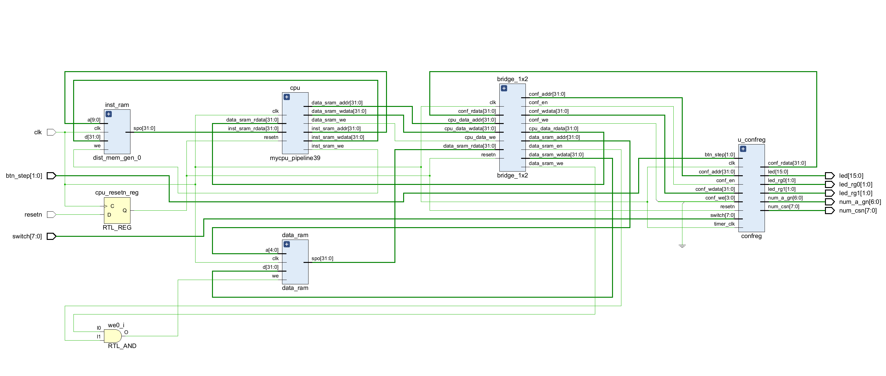
### 3.1.2 CPU电路图
由于电路图过大，无法显示清晰
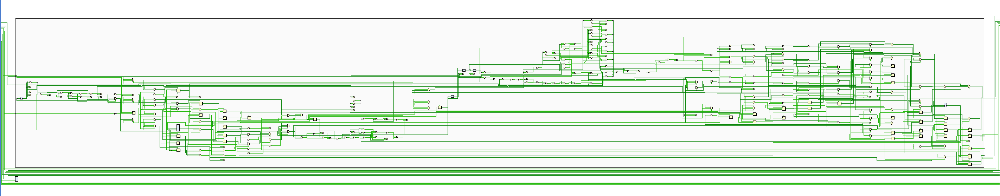
### 3.2 电路资源使用图
#### 3.2.1 不含乘法指令
可以看出LUT使用1922个，FF使用1328个，IO使用47个
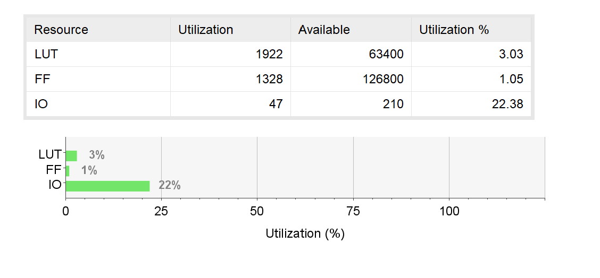

#### 3.2.2 含乘法指令
可以看出LUT使用1815个，FF使用1328个，IO使用47个
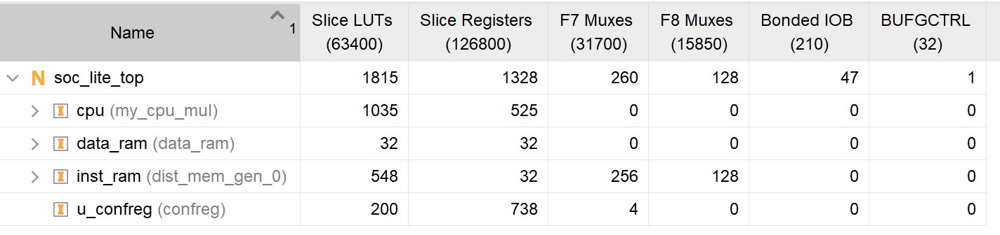
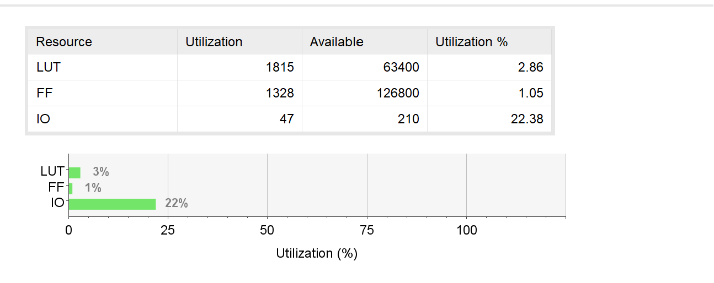
### 3.3 电路性能
#### 3.3.1 不含乘法指令
由下图可知，设置的时钟周期为10ns，实际上需要时间约11ns，还需要大约0.8ns
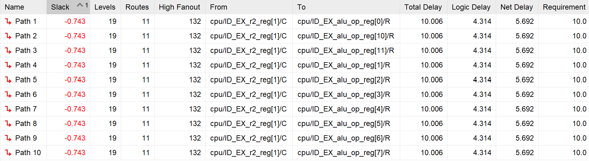

总的时钟延迟如下，Setup类型延迟如上图，在Hold类型中，设置周期为10ns，时钟延迟约9.9ns。
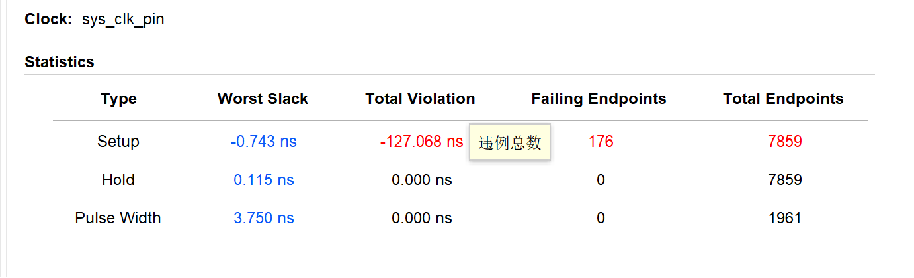

#### 3.3.2 含乘法指令
最长路径延迟为1.035ns，大于不含乘法指令的时钟延迟
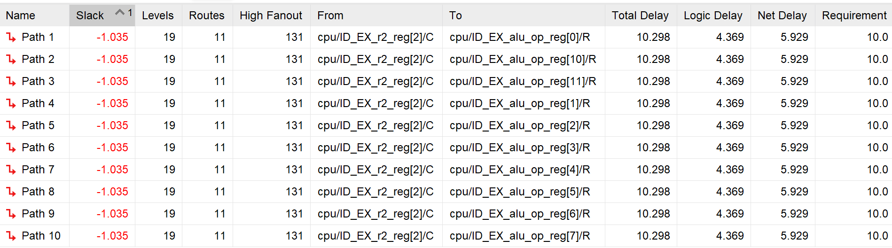
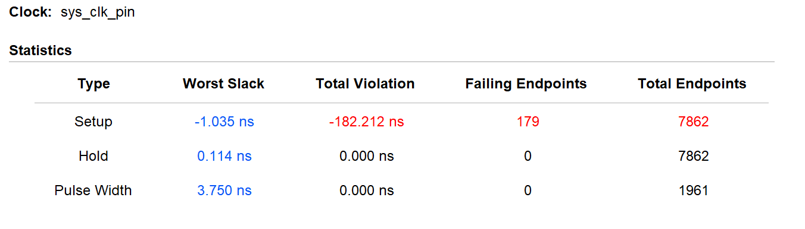
## 4 仿真
### 4.1 20条指令测试仿真结果
使用编译生成20条精简指令测试集，可以看出指令测试通过

### 4.2 39条指令仿真结果
由于测试集较大，所以截取最后一部分测试结果，可知39条指令测试均通过

### 4.3 含乘法指令仿真结果
由于没有乘法指令测试集，无法严格判断。流水线CPU是在单周期CPU基础上改进，其中ALU模块均在执行阶段执行，只需要传递操作数，不需要改变模块内部逻辑，根据单周期CPU的结果，加上对乘法模块的测试，所以可以推断正确。
x，y均为32'hffffffff 有符号数，结果正确
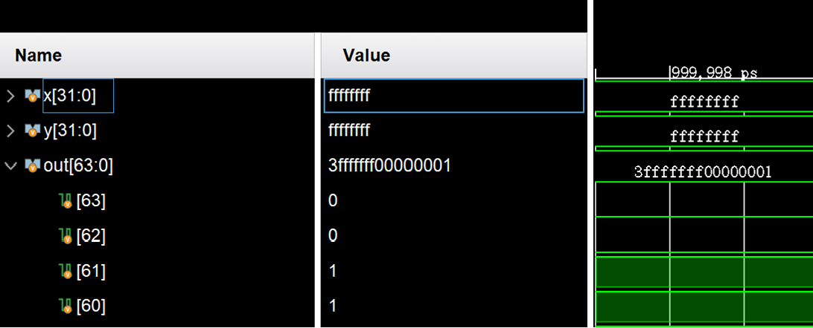
## 5 上板结果
### 5.1 39条指令测试上板结果
在上板测试中，数据均为16进制，第一个27H表示一共测试了39条指令,第二个27H表示通过了39条指令
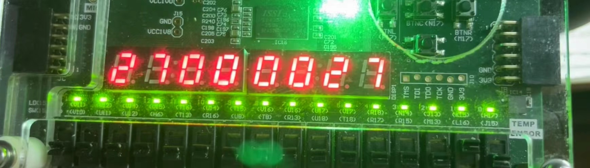
### 5.2 冒泡排序上板结果
一共设置了16个数，从0到3cH每次加4，初始状态为从0到3cH的升序排列，开关表示索引。
索引为0时
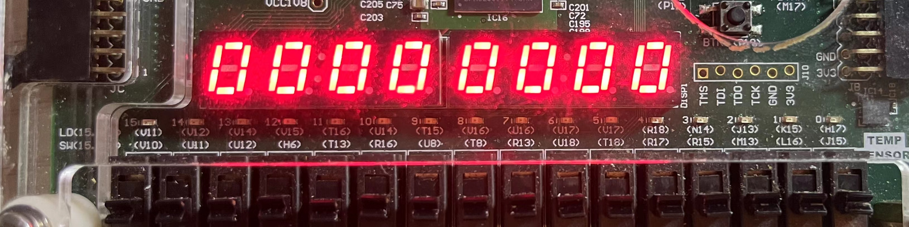
索引为1时
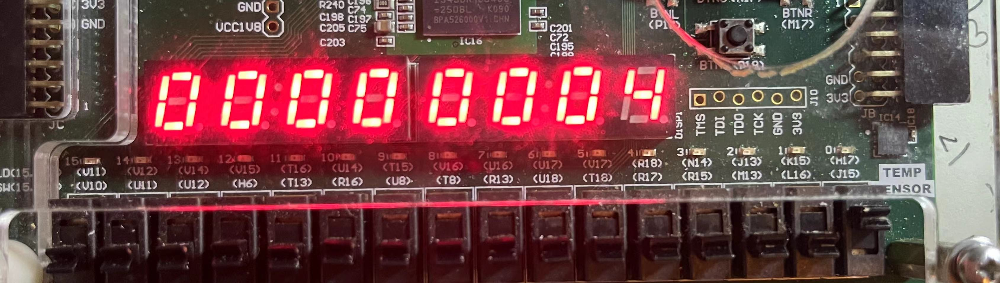
排序后
索引为0时
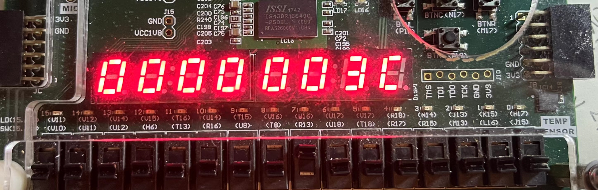
索引为1时
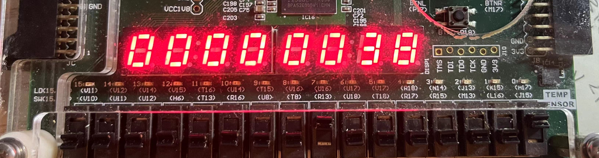
## 6 遇到的问题
1. **问题**：处于WB阶段的指令对某寄存器写回的同时，处于译码阶段的指令正在访问该寄存器，导致取值错误
   **解决方法**：添加一个forwarding信号判断正在写回的寄存器和正在访问的寄存器是否相等，相等则将写回的值前递。
2. **问题**：处理跳转指令时将跳转指令分为无条件跳转和有条件跳转两类，分别在不同阶段进行跳转，导致信号复杂，后续指令传输出现问题。
   **解决方法**：统一处理跳转指令，在执行阶段判断是否进行跳转。
## 7 附录（核心模块代码）
### 7.1 CPU
```verilog
module mycpu_pipeline39 (
    input  wire        clk,
    input  wire        resetn,
    // inst sram interface
    output wire        inst_sram_we,
    output wire [31:0] inst_sram_addr,
    output wire [31:0] inst_sram_wdata,
    input  wire [31:0] inst_sram_rdata,
    // data sram interface
    output wire        data_sram_we,
    output wire [31:0] data_sram_addr,
    output wire [31:0] data_sram_wdata,
    input  wire [31:0] data_sram_rdata,
    // trace debug interface
    output wire [31:0] debug_wb_pc,
    output wire [ 3:0] debug_wb_rf_we,
    output wire [ 4:0] debug_wb_rf_wnum,
    output wire [31:0] debug_wb_rf_wdata
);
reg         reset;
always @(posedge clk) reset <= ~resetn;
reg         valid;
always @(posedge clk) begin
    if (reset) begin
        valid <= 1'b0;
    end
    else begin
        valid <= 1'b1;
    end
end
wire [31:0] true_rf_data_1;
wire [31:0] true_rf_data_2;
wire bubble;
wire        br;
reg [31:0] ID_EX_br_target;
//////////////////////////////////////////////////////////////////
// FETCH stage -> DECODE                                       ///
//////////////////////////////////////////////////////////////////
wire [31:0] seq_pc;
wire [31:0] nextpc;
wire [31:0] inst;
reg [31:0] pc;
assign seq_pc = pc + 3'h4;
// reg  [31:0] pc;

assign nextpc       =   bubble   ? pc        :
                        br ? ID_EX_br_target : seq_pc;

always @(posedge clk) begin
    if (reset) begin
        pc <= 32'h1bfffffc;     //trick: to make nextpc be 0x1c000000 during reset 
    end
    else begin
        pc <= nextpc;
    end
end
assign inst_sram_we    = 1'b0;
assign inst_sram_addr  = pc;
assign inst_sram_wdata = 32'b0;
assign inst            = pc == 32'h1bfffffc ? 32'd0: inst_sram_rdata;
reg [31:0] IF_ID_pc;
reg [31:0] IF_ID_inst;
always @(posedge clk) begin
    if(reset) begin
        IF_ID_pc <= 32'h1bfffffc;
        IF_ID_inst <= 32'd0;
    end
    else begin
        IF_ID_pc <=  bubble ||br ? 32'd0 : pc;
        IF_ID_inst <=  bubble || br ? 32'd0 : inst;
    end
end

//////////////////////////////////////////////////////////////////
//  DECODE stage -> EXECUTE                                    ///
//////////////////////////////////////////////////////////////////
wire [ 5:0] op_31_26;
wire [ 3:0] op_25_22;
wire [ 1:0] op_21_20;
wire [ 4:0] op_19_15;

wire [63:0] op_31_26_d;
wire [15:0] op_25_22_d;
wire [ 3:0] op_21_20_d;
wire [31:0] op_19_15_d;

assign op_31_26  = IF_ID_inst[31:26];
assign op_25_22  = IF_ID_inst[25:22];
assign op_21_20  = IF_ID_inst[21:20];
assign op_19_15  = IF_ID_inst[19:15];

decoder_6_64 u_dec0(.in(op_31_26 ), .out(op_31_26_d ));
decoder_4_16 u_dec1(.in(op_25_22 ), .out(op_25_22_d ));
decoder_2_4  u_dec2(.in(op_21_20 ), .out(op_21_20_d ));
decoder_5_32 u_dec3(.in(op_19_15 ), .out(op_19_15_d ));

wire        inst_add_w;
wire        inst_sub_w;
wire        inst_slt;
wire        inst_sltu;
wire        inst_nor;
wire        inst_and;
wire        inst_or;
wire        inst_xor;
wire        inst_slli_w;
wire        inst_srli_w;
wire        inst_srai_w;
wire        inst_addi_w;
wire        inst_ld_w;
wire        inst_st_w;
wire        inst_jirl;
wire        inst_b;
wire        inst_bl;
wire        inst_beq;
wire        inst_bne;
wire        inst_lu12i_w;

wire        inst_pcaddu12i;
wire        inst_slti;
wire        inst_sltui;
wire        inst_andi;
wire        inst_ori;
wire        inst_xori;
wire        inst_sll_w;
wire        inst_srl_w;
wire        inst_sra_w;
wire        inst_ld_b;
wire        inst_st_b;
wire        inst_st_h;
wire        inst_ld_h;
wire        inst_ld_hu;
wire        inst_ld_bu;
wire        inst_blt;
wire        inst_bge;
wire        inst_bltu;
wire        inst_bgeu;

assign inst_add_w  = op_31_26_d[6'h00] & op_25_22_d[4'h0] & op_21_20_d[2'h1]
                     & op_19_15_d[5'h00];
assign inst_sub_w  = op_31_26_d[6'h00] & op_25_22_d[4'h0] & op_21_20_d[2'h1]
                     & op_19_15_d[5'h02];
assign inst_slt    = op_31_26_d[6'h00] & op_25_22_d[4'h0] & op_21_20_d[2'h1]
                     & op_19_15_d[5'h04];
assign inst_sltu   = op_31_26_d[6'h00] & op_25_22_d[4'h0] & op_21_20_d[2'h1]
                     & op_19_15_d[5'h05];
assign inst_nor    = op_31_26_d[6'h00] & op_25_22_d[4'h0] & op_21_20_d[2'h1]
                     & op_19_15_d[5'h08];
assign inst_and    = op_31_26_d[6'h00] & op_25_22_d[4'h0] & op_21_20_d[2'h1]
                     & op_19_15_d[5'h09];
assign inst_or     = op_31_26_d[6'h00] & op_25_22_d[4'h0] & op_21_20_d[2'h1]
                     & op_19_15_d[5'h0a];
assign inst_xor    = op_31_26_d[6'h00] & op_25_22_d[4'h0] & op_21_20_d[2'h1]
                     & op_19_15_d[5'h0b];
assign inst_slli_w = op_31_26_d[6'h00] & op_25_22_d[4'h1] & op_21_20_d[2'h0]
                     & op_19_15_d[5'h01];
assign inst_srli_w = op_31_26_d[6'h00] & op_25_22_d[4'h1] & op_21_20_d[2'h0]
                     & op_19_15_d[5'h09];
assign inst_srai_w = op_31_26_d[6'h00] & op_25_22_d[4'h1] & op_21_20_d[2'h0]
                     & op_19_15_d[5'h11];
assign inst_addi_w = op_31_26_d[6'h00] & op_25_22_d[4'ha];
assign inst_ld_w   = op_31_26_d[6'h0a] & op_25_22_d[4'h2];
assign inst_st_w   = op_31_26_d[6'h0a] & op_25_22_d[4'h6];
assign inst_jirl   = op_31_26_d[6'h13];
assign inst_b      = op_31_26_d[6'h14];
assign inst_bl     = op_31_26_d[6'h15];
assign inst_beq    = op_31_26_d[6'h16];
assign inst_bne    = op_31_26_d[6'h17];
assign inst_lu12i_w= op_31_26_d[6'h05] & ~IF_ID_inst[25];

assign inst_sll_w  = op_31_26_d[6'h00] & op_25_22_d[4'h0] & op_21_20_d[2'h1] 
                    & op_19_15_d[5'h0e];
assign inst_srl_w  = op_31_26_d[6'h00] & op_25_22_d[4'h0] & op_21_20_d[2'h1] 
                    & op_19_15_d[5'h0f];
assign inst_sra_w  = op_31_26_d[6'h00] & op_25_22_d[4'h0] & op_21_20_d[2'h1] 
                    & op_19_15_d[5'h10];
assign inst_slti   = op_31_26_d[6'h00] & op_25_22_d[4'h8];
assign inst_sltui  = op_31_26_d[6'h00] & op_25_22_d[4'h9];
assign inst_andi   = op_31_26_d[6'h00] & op_25_22_d[4'hd];
assign inst_ori    = op_31_26_d[6'h00] & op_25_22_d[4'he];
assign inst_xori   = op_31_26_d[6'h00] & op_25_22_d[4'hf];
assign inst_ld_b   = op_31_26_d[6'h0a] & op_25_22_d[4'h0];
assign inst_st_b   = op_31_26_d[6'h0a] & op_25_22_d[4'h4];
assign inst_st_h   = op_31_26_d[6'h0a] & op_25_22_d[4'h5];
assign inst_ld_h   = op_31_26_d[6'h0a] & op_25_22_d[4'h1];
assign inst_ld_hu  = op_31_26_d[6'h0a] & op_25_22_d[4'h9];
assign inst_ld_bu  = op_31_26_d[6'h0a] & op_25_22_d[4'h8];
assign inst_blt    = op_31_26_d[6'h18];
assign inst_bge    = op_31_26_d[6'h19];
assign inst_bltu   = op_31_26_d[6'h1a];
assign inst_bgeu   = op_31_26_d[6'h1b];
assign inst_pcaddu12i = op_31_26_d[6'h07] & ~inst[25];

wire        need_ui12;
wire        need_ui5;
wire        need_si12;
wire        need_si16;
wire        need_si20;
wire        need_si26;
wire        src2_is_4;

assign need_ui5   =  inst_slli_w | inst_srli_w | inst_srai_w;
assign need_si12  =  inst_addi_w | inst_ld_w | inst_st_w | inst_ld_b | inst_ld_h|
                     inst_ld_bu  | inst_st_b | inst_st_h | inst_ld_hu;
assign need_ui12  =  inst_andi | inst_ori | inst_xori;
assign need_si16  =  inst_jirl | inst_beq | inst_bne | inst_blt | inst_bge |
                     inst_bltu | inst_bgeu;
assign need_si20  =  inst_lu12i_w | inst_pcaddu12i;
assign need_si26  =  inst_b | inst_bl;
assign src2_is_4  =  inst_jirl | inst_bl;

wire [ 4:0] rd;
wire [ 4:0] rj;
wire [ 4:0] rk;

assign rd   = IF_ID_inst[ 4: 0];
assign rj   = IF_ID_inst[ 9: 5];
assign rk   = IF_ID_inst[14:10];

wire [11:0] i12;
wire [19:0] i20;
wire [15:0] i16;
wire [25:0] i26;

assign i12  = IF_ID_inst[21:10];
assign i20  = IF_ID_inst[24: 5];
assign i16  = IF_ID_inst[25:10];
assign i26  = {IF_ID_inst[ 9: 0], IF_ID_inst[25:10]};
// 得到立即�?
wire [31:0] imm;
assign imm = src2_is_4 ? 32'h4                      :
             need_si20 ? {i20[19:0], 12'b0}         :
             need_ui12 ? {20'd0, i12[11:0]}         :
             need_ui5  ? {27'd0, rk}                :
            {{20{i12[11]}}, i12[11:0]} ;
wire   src2_is_imm;
assign src2_is_imm   = inst_slli_w |
                       inst_srli_w |
                       inst_srai_w |
                       inst_addi_w |
                       inst_ld_w   |
                       inst_st_w   |
                       inst_lu12i_w|
                       inst_jirl   |
                       inst_bl     |
                       inst_pcaddu12i |
                       inst_slti   |
                       inst_sltui  |
                       inst_andi   |
                       inst_ori    |
                       inst_xori   |
                       inst_ld_b   |
                       inst_ld_h   |
                       inst_ld_bu  |
                       inst_ld_hu  |
                       inst_st_b   |
                       inst_st_h   ;


wire   src1_is_pc;
assign src1_is_pc    = inst_jirl | inst_bl | inst_pcaddu12i;
wire [ 4:0] rf_raddr1;
wire [31:0] rf_rdata1;
wire [ 4:0] rf_raddr2;
wire [31:0] rf_rdata2;
wire        rf_we   ;
wire [ 4:0] rf_waddr;
wire [31:0] rf_wdata;

wire        src_reg_is_rd;
assign src_reg_is_rd = inst_beq | inst_bne | inst_st_w | inst_st_h | inst_st_b
                     | inst_blt | inst_bltu | inst_bgeu | inst_bge ;

wire       gr_we;
assign gr_we         = (~inst_st_w & ~inst_beq & ~inst_bne & ~inst_b  & ~inst_st_b &
                       ~inst_st_h & ~inst_bge & ~inst_blt & ~inst_bgeu & ~inst_bltu)
                        && IF_ID_pc;

wire        dst_is_r1;
wire [4: 0] dest;
assign dst_is_r1     = inst_bl;
assign dest          = dst_is_r1 ? 5'd1 : rd;

wire   res_from_mem;
assign res_from_mem  = inst_ld_w | inst_ld_b | inst_ld_h | inst_ld_bu | inst_ld_hu;

assign rf_raddr1 = rj;
assign rf_raddr2 = src_reg_is_rd ? rd :rk;
// 读寄存器
regfile u_regfile(
    .clk    (clk      ),
    .raddr1 (rf_raddr1),
    .rdata1 (rf_rdata1),
    .raddr2 (rf_raddr2),
    .rdata2 (rf_rdata2),
    .we     (rf_we    ),
    .waddr  (rf_waddr ),
    .wdata  (rf_wdata )
);
// alu 操作
wire [11:0] alu_op;
assign alu_op[ 0] = inst_add_w | inst_addi_w | inst_ld_w | inst_st_w
                    | inst_jirl | inst_bl | inst_pcaddu12i | inst_ld_b
                    | inst_ld_bu | inst_ld_h | inst_ld_hu | inst_st_b
                    | inst_st_h;

assign alu_op[ 1] = inst_sub_w;
assign alu_op[ 2] = inst_slt    | inst_slti | inst_blt | inst_bge;
assign alu_op[ 3] = inst_sltu   | inst_sltui | inst_bltu | inst_bgeu;
assign alu_op[ 4] = inst_and    | inst_andi;
assign alu_op[ 5] = inst_nor;
assign alu_op[ 6] = inst_or     | inst_ori;
assign alu_op[ 7] = inst_xor    | inst_xori;
assign alu_op[ 8] = inst_slli_w | inst_sll_w;
assign alu_op[ 9] = inst_srli_w | inst_srl_w;
assign alu_op[10] = inst_srai_w | inst_sra_w;
assign alu_op[11] = inst_lu12i_w ;
// 写内存信�?
wire        mem_we;
assign mem_we        = inst_st_w | inst_st_b | inst_st_h;

// 跳转信号
wire [31:0] rj_value;
wire [31:0] rkd_value;
assign rj_value  = rf_rdata1;
assign rkd_value = rf_rdata2;
wire [8:0]  br_taken;
// wire        rj_eq_rd;
// assign rj_eq_rd = (rj_value == rkd_value);
assign br_taken = {inst_bgeu ,inst_bge,inst_bltu,inst_blt,inst_beq,
                     inst_bne, inst_jirl, inst_bl, inst_b};

wire [31:0] br_offs;
wire [31:0] br_target;
wire [31:0] jirl_offs;
assign jirl_offs = {{14{i16[15]}}, i16[15:0], 2'b0};
assign br_offs = need_si26 ? {{ 4{i26[25]}}, i26[25:0], 2'b0} :
          {{14{i16[15]}}, i16[15:0], 2'b0} ;

// 可能会出错
assign br_target = (inst_beq || inst_bne || inst_bl || inst_b || inst_blt 
                || inst_bltu || inst_bge || inst_bgeu) ? (IF_ID_pc + br_offs) :
                 (rj_value + jirl_offs);

reg [31:0] ID_EX_pc;
//reg [31:0] ID_EX_br_target;
reg [ 4:0] ID_EX_rd;
reg [ 4:0] ID_EX_r1;
reg [ 4:0] ID_EX_r2;
reg [ 8:0] ID_EX_br_taken;
reg [31:0] ID_EX_imm;
reg [31:0] ID_EX_rf_rdata1;
reg [31:0] ID_EX_rf_rdata2;
reg [11:0] ID_EX_alu_op;
reg        ID_EX_mem_we;
// reg        ID_EX_br_taken;
reg        ID_EX_gr_we;
reg        ID_EX_src2_is_imm;
reg        ID_EX_src1_is_pc;
reg        ID_EX_res_from_mem;
reg [2:0]  ID_EX_st;   
reg [4:0]  ID_EX_ld;   
always @(posedge clk) begin
    if(reset) begin
        ID_EX_pc           <=  32'd0;
        ID_EX_rd           <=  5'd0 ;
        ID_EX_imm          <=  32'd0;
        ID_EX_rf_rdata1    <=  32'd0;
        ID_EX_rf_rdata2    <=  32'd0;
        ID_EX_alu_op       <=  12'd0;
        ID_EX_mem_we       <=  1'b0;
        ID_EX_gr_we        <=  1'b0; 
        ID_EX_src2_is_imm  <=  1'b0;
        ID_EX_src1_is_pc   <=  1'b0;
        ID_EX_res_from_mem <=  1'b0;
        ID_EX_br_target    <=  1'b0;
        ID_EX_br_taken     <=  5'd0;     
        ID_EX_r1           <=  5'd0;  
        ID_EX_r2           <=  5'd0;  
        ID_EX_st           <=  3'd0;
    end
    else begin
        ID_EX_pc           <= (!br) ? IF_ID_pc        : 32'd0;
        ID_EX_rd           <= (!br) ? dest            : 5'd0 ;
        ID_EX_imm          <= (!br) ? imm             : 32'd0;
        ID_EX_rf_rdata1    <= (!br) ? rf_rdata1       : 32'd0;
        ID_EX_rf_rdata2    <= (!br) ? rf_rdata2       : 32'd0;
        ID_EX_alu_op       <= (!br) ? alu_op          : 12'd0;
        ID_EX_mem_we       <= (!br) ? mem_we          : 1'b0;
        // ID_EX_br_taken     (!br) ? <= br_taken;
        ID_EX_gr_we        <= (!br) ? gr_we           : 1'b0; 
        ID_EX_src2_is_imm  <= (!br) ? src2_is_imm     : 1'b0;
        ID_EX_src1_is_pc   <= (!br) ? src1_is_pc      : 1'b0;
        ID_EX_res_from_mem <= (!br) ? res_from_mem    : 1'b0;
        ID_EX_br_target    <= (!br) ? br_target       : 1'b0;
        ID_EX_br_taken     <= (!br) ? br_taken        : 5'd0;
        ID_EX_r1           <= (!br) ? rf_raddr1       : 5'd0;  
        ID_EX_r2           <= (!br) ? rf_raddr2       : 5'd0;     
        ID_EX_st           <= (!br) ? {inst_st_w, inst_st_h, inst_st_b} : 3'd0;
        ID_EX_ld           <= (!br) ? {inst_ld_w, inst_ld_h, inst_ld_hu, inst_ld_b,
                                         inst_ld_bu}: 5'd0;
    end

end

//////////////////////////////////////////////////////////////////
//  EXECUTE stage -> MEMORY                                    ///
//////////////////////////////////////////////////////////////////

wire [31:0] alu_src1   ;
wire [31:0] alu_src2   ;
wire [31:0] alu_result ;

assign alu_src1 = ID_EX_src1_is_pc  ? ID_EX_pc[31:0] :  true_rf_data_1;
assign alu_src2 = ID_EX_src2_is_imm ? ID_EX_imm : true_rf_data_2;
alu u_alu(
    .alu_op     (ID_EX_alu_op),
    .alu_src1   (alu_src1  ),
    .alu_src2   (alu_src2  ),
    .alu_result (alu_result)
);

wire        rj_eq_rd;
assign rj_eq_rd = (true_rf_data_1 == true_rf_data_2);
//wire        br;
assign      br = ((ID_EX_br_taken[4] && rj_eq_rd) || (ID_EX_br_taken[3] && !rj_eq_rd)
                ||(ID_EX_br_taken[2]) || ID_EX_br_taken[1] || ID_EX_br_taken[0]
                ||(ID_EX_br_taken[5] && alu_result[0]) || (ID_EX_br_taken[6]
                 && alu_result[0])
                ||(ID_EX_br_taken[7] && !alu_result[0]) || (ID_EX_br_taken[8]
                 && !alu_result[0]))?1'b1:1'b0;

reg [31:0] EX_MEM_alu_result;
reg [ 4:0] EX_MEM_rd;
reg [31:0] EX_MEM_pc;
reg [31:0] EX_MEM_rd_value;
reg        EX_MEM_mem_we;
reg        EX_MEM_gr_we;
reg        EX_MEM_res_from_mem;
reg [2:0]  EX_MEM_st;   
reg [4:0]  EX_MEM_ld;   
always @(posedge clk) begin
    if(reset) begin
        EX_MEM_alu_result    <= 32'd0;
        EX_MEM_rd            <= 5'd0;
        EX_MEM_pc            <= 32'd0;
        EX_MEM_rd_value      <= 32'd0;
        EX_MEM_mem_we        <= 1'd0;
        EX_MEM_gr_we         <= 1'd0;   
        EX_MEM_res_from_mem  <= 1'd0;      
        EX_MEM_ld            <= 5'd0;
        EX_MEM_st            <= 3'd0;
    end
    else begin
            EX_MEM_alu_result    <= alu_result        ;
            EX_MEM_rd            <= ID_EX_rd          ;
            EX_MEM_pc            <= ID_EX_pc          ;
            EX_MEM_rd_value      <= true_rf_data_2    ;
            EX_MEM_mem_we        <= ID_EX_mem_we      ;
            EX_MEM_gr_we         <= ID_EX_gr_we       ;   
            EX_MEM_res_from_mem  <= ID_EX_res_from_mem;
            EX_MEM_ld            <= ID_EX_ld;   
            EX_MEM_st            <= ID_EX_st;   
    end

end
//////////////////////////////////////////////////////////////////
//  MEMORY stage -> WRITE BACK                                 ///
//////////////////////////////////////////////////////////////////
// wire [31:0] data_sram_rdata;
wire [1:0] ld_half_op;
wire [7:0] ld_b_data;
wire [3:0] ld_byte_op;
assign ld_half_op = EX_MEM_alu_result[1] ? 2'b10 : 2'b01;
assign ld_byte_op = EX_MEM_alu_result[0] ? (EX_MEM_alu_result[1] ? (4'b1000): (4'b0010)):
                    (EX_MEM_alu_result[1] ?(4'b0100) : (4'b0001) );

assign ld_b_data   = ({8{ld_byte_op[0]}} & data_sram_rdata[7:0] ) |
                    ({8{ld_byte_op[1]}} & data_sram_rdata[15:8]) |
                    ({8{ld_byte_op[2]}} & data_sram_rdata[23:16]) |
                    ({8{ld_byte_op[3]}} & data_sram_rdata[31:24]);

wire [15:0] ld_h_data ;

assign ld_h_data  = ({16{ld_half_op[1]}} & data_sram_rdata[31:16]) |
                    ({16{ld_half_op[0]}} & data_sram_rdata[15: 0]);

wire [31:0] st_b_data ;
wire [31: 0] st_half_data ;
wire [31: 0] st_data;
wire  st_dram;
assign st_data = st_dram ? MEM_WB_data : data_sram_rdata;
assign st_b_data   = ld_byte_op[3] ? {EX_MEM_rd_value[7:0], st_data[23:0]}:
                     (ld_byte_op[2] ? {st_data[31:24], EX_MEM_rd_value[7:0], st_data[15:0]} :
                     (ld_byte_op[1] ? {st_data[31:16], EX_MEM_rd_value[7:0],  st_data[7:0]} :
                     {st_data[31:8], EX_MEM_rd_value[7:0]}));
assign st_half_data = ld_half_op[0] ? {st_data[31:16], EX_MEM_rd_value[15:0]}
                                        :{EX_MEM_rd_value[15:0],st_data[15:0]};

assign data_sram_we    = EX_MEM_mem_we && valid  ;
assign data_sram_addr  = EX_MEM_alu_result;
// assign data_sram_wdata = EX_MEM_rd_value  ;
assign data_sram_wdata = EX_MEM_st[2] ? EX_MEM_rd_value :
                        (EX_MEM_st[1] ? st_half_data     :
                        st_b_data);
// ({32{EX_MEM_st[2]}} & EX_MEM_rd_value) | 
//                          ({32{EX_MEM_st[1]}} & st_half_data) |
//                          ({32{EX_MEM_st[0]}} & st_b_data);


wire [31:0] mem_result;
assign mem_result   = EX_MEM_ld[4]   ? data_sram_rdata       :
                      EX_MEM_ld[1]   ? {{24{ld_b_data[7]}} ,ld_b_data}:
                      EX_MEM_ld[3]   ? {{16{ld_h_data[15]}}, ld_h_data} :
                      EX_MEM_ld[0]   ? {24'd0, ld_b_data} :
                      {16'd0, ld_h_data};

reg [31:0] MEM_WB_result;
reg [31:0] MEM_WB_pc;
reg [31:0] MEM_WB_alu_result;
reg [ 4:0] MEM_WB_rd;
reg        MEM_WB_gr_we;
reg        MEM_WB_res_from_mem;
reg [31:0] MEM_WB_data;
reg        MEM_WB_mem_we;
always @(posedge clk) begin
    if(reset) begin
        MEM_WB_alu_result   <= 32'd0;
        MEM_WB_result       <= 32'd0;
        MEM_WB_gr_we        <= 1'd0;
        MEM_WB_rd           <= 5'd0;
        MEM_WB_res_from_mem <= 1'd0;
        MEM_WB_pc           <= 32'd0;       
        MEM_WB_mem_we       <= 1'd0;
        MEM_WB_data         <= 32'd0;
    end
    else begin
        MEM_WB_alu_result   <= EX_MEM_alu_result  ;
        MEM_WB_result       <= mem_result         ;
        MEM_WB_gr_we        <= EX_MEM_gr_we       ;
        MEM_WB_rd           <= EX_MEM_rd          ;
        MEM_WB_res_from_mem <= EX_MEM_res_from_mem;
        MEM_WB_pc           <= EX_MEM_pc          ;        
        MEM_WB_mem_we       <= EX_MEM_mem_we      ;
        MEM_WB_data         <= data_sram_wdata    ;
    end

end
//////////////////////////////////////////////////////////////////
//  WRITE BACK                                                 ///
//////////////////////////////////////////////////////////////////
wire [31:0] final_result;
assign final_result = MEM_WB_res_from_mem ? MEM_WB_result : MEM_WB_alu_result;
assign rf_we = MEM_WB_gr_we;
assign rf_waddr = MEM_WB_rd;
assign rf_wdata = final_result;
reg [31:0] WB_rd;
reg [31:0] result;
reg  WB_rd_we;
always @(posedge clk) begin
    if(reset) begin
        WB_rd <=0;        
        WB_rd_we <=0;        
        result <= 32'd0;
    end
    else begin
        WB_rd <= MEM_WB_rd;        
        WB_rd_we <= MEM_WB_gr_we;    
        result <=final_result;    
    end 

end
//////////////////////////////////////////////////////////////////
//  相关                                                       ///
//////////////////////////////////////////////////////////////////
wire EX_MEM_forward_op_rj;
wire EX_MEM_forward_op_rk;

wire MEM_WB_forward_op_rj;
wire MEM_WB_forward_op_rk;

wire ID_EX_forward_op_rj;
wire ID_EX_forward_op_rk;

// wire ST_LD;

assign ID_EX_forward_op_rj  = (WB_rd == ID_EX_r1)      ? 1'b1 : 1'b0;
assign ID_EX_forward_op_rk  = (WB_rd == ID_EX_r2)      ? 1'b1 : 1'b0;
assign EX_MEM_forward_op_rj = (ID_EX_r1 == EX_MEM_rd ) ? 1'b1 : 1'b0;      
assign EX_MEM_forward_op_rk = (ID_EX_r2 == EX_MEM_rd ) ? 1'b1 : 1'b0;
assign MEM_WB_forward_op_rj = (ID_EX_r1 == MEM_WB_rd)  ? 1'b1 : 1'b0;
assign MEM_WB_forward_op_rk = (ID_EX_r2 == MEM_WB_rd)  ? 1'b1 : 1'b0;

// wire [31:0] EX_MEM_alu_result_wire;
// wire [31:0] ID_EX_rf_rdata1_wire;
// wire [31:0] ID_EX_rf_rdata2_wire;


assign true_rf_data_1 = (EX_MEM_gr_we && EX_MEM_forward_op_rj) ? EX_MEM_alu_result : 
                        ((MEM_WB_gr_we && MEM_WB_forward_op_rj) ? final_result      :
                        (WB_rd_we && ID_EX_forward_op_rj)      ? result             :
                         ID_EX_rf_rdata1);
assign true_rf_data_2 = (EX_MEM_gr_we && EX_MEM_forward_op_rk) ? EX_MEM_alu_result : 
                        ((MEM_WB_gr_we && MEM_WB_forward_op_rk) ? final_result :
                        (WB_rd_we && ID_EX_forward_op_rk)     ? result  : ID_EX_rf_rdata2);

// wire st_dram;
assign st_dram = (MEM_WB_alu_result[31:2] == EX_MEM_alu_result[31:2]) && MEM_WB_mem_we ?
                 1'b1: 1'b0;
//////////////////////////////////////////////////////////////////
//  Bubble                                                     ///
//////////////////////////////////////////////////////////////////
//wire bubble;
assign bubble = (res_from_mem) ? 1'b1 :1'b0;
assign debug_wb_pc       = MEM_WB_pc;
assign debug_wb_rf_we   = {4{rf_we}};
assign debug_wb_rf_wnum  = MEM_WB_rd;
assign debug_wb_rf_wdata = final_result;
endmodule
```
### ALU


```verilog
module alu(
    input  wire [14:0] alu_op,
    input  wire [31:0] alu_src1,
    input  wire [31:0] alu_src2,
    output wire [31:0] alu_result
  );

  wire op_add;   //add operation
  wire op_sub;   //sub operation
  wire op_slt;   //signed compared and set less than
  wire op_sltu;  //unsigned compared and set less than
  wire op_and;   //bitwise and
  wire op_nor;   //bitwise nor
  wire op_or;    //bitwise or
  wire op_xor;   //bitwise xor
  wire op_sll;   //logic left shift
  wire op_srl;   //logic right shift
  wire op_sra;   //arithmetic right shift
  wire op_lui;   //Load Upper Immediate
  
  wire op_mul_w;
  wire op_mul_h;
  wire op_mul_wu;

  // control code decomposition
  assign op_add  = alu_op[ 0];
  assign op_sub  = alu_op[ 1];
  assign op_slt  = alu_op[ 2];
  assign op_sltu = alu_op[ 3];
  assign op_and  = alu_op[ 4];
  assign op_nor  = alu_op[ 5];
  assign op_or   = alu_op[ 6];
  assign op_xor  = alu_op[ 7];
  assign op_sll  = alu_op[ 8];
  assign op_srl  = alu_op[ 9];
  assign op_sra  = alu_op[10];
  assign op_lui  = alu_op[11];

 assign op_mul_w = alu_op[12];
 assign op_mul_h = alu_op[13];
 assign op_mul_wu = alu_op[14];

  wire [31:0] add_sub_result;
  wire [31:0] slt_result;
  wire [31:0] sltu_result;
  wire [31:0] and_result;
  wire [31:0] nor_result;
  wire [31:0] or_result;
  wire [31:0] xor_result;
  wire [31:0] lui_result;
  wire [31:0] sll_result;
  wire [63:0] sr64_result;
  wire [31:0] sr_result;


  // 32-bit adder
  wire [31:0] adder_a;
  wire [31:0] adder_b;
  wire        adder_cin;
  wire [31:0] adder_result;
  wire        adder_cout;

 wire [31:0] mul_a ;
 wire [31:0] mul_b ;
 wire [63:0] out ;

 assign mul_a = op_mul_wu ? {1'b0, alu_src1[30:0]} : 
               alu_src1[31]  ?(~alu_src1+1):alu_src1;
 assign mul_b = op_mul_wu ? {1'b0, alu_src2[30:0]} :
              alu_src2[31]?(~alu_src2 + 1): alu_src2;

 wire [63: 0] mul_u_1;
 wire [63: 0] mul_u_2;
 wire [63: 0] mul_u_3;

 assign mul_u_1 = alu_src2[31] ? (mul_a << 31) : 32'd0;
 assign mul_u_2 = alu_src1[31] ? (mul_b << 31) : 32'd0;
 assign mul_u_3 = (alu_src1[31] && alu_src2[31]) ? 64'h4000000000000000 : 64'd0;

 Multi_impro multi(
    .x(mul_a),
    .y0(mul_b),
    .out(out)
 );
 wire [63:0] multi_result;
 assign multi_result = op_mul_wu ? (mul_u_1 + mul_u_2 + mul_u_3 + out) : 
                    (alu_src1[31] ^ alu_src2[31]) ? ~out+1: out;


  assign adder_a   = alu_src1;
  assign adder_b   = (op_sub | op_slt | op_sltu) ? ~alu_src2 : alu_src2;  //src1 - src2 rj-rk
  assign adder_cin = (op_sub | op_slt | op_sltu) ? 1'b1      : 1'b0;
  assign {adder_cout, adder_result} = adder_a + adder_b + adder_cin;

  // ADD, SUB result
  assign add_sub_result = adder_result;

  // SLT result
  assign slt_result[31:1] = 31'b0;   //rj < rk 1
  assign slt_result[0]    = (alu_src1[31] & ~alu_src2[31])
         | ((alu_src1[31] ~^ alu_src2[31]) & adder_result[31]);

  // SLTU result
  assign sltu_result[31:1] = 31'b0;
  assign sltu_result[0]    = ~adder_cout;

  // bitwise operation
  assign and_result = alu_src1 & alu_src2;
  assign or_result  = alu_src1 | alu_src2;
  assign nor_result = ~or_result;
  assign xor_result = alu_src1 ^ alu_src2;
  assign lui_result = alu_src2;

  // SLL result
  assign sll_result = alu_src1 << alu_src2[4:0];   //rj << ui5

  // SRL, SRA result
  assign sr64_result = {{32{op_sra & alu_src1[31]}}, alu_src1[31:0]} >> alu_src2[4:0]; //rj >> i5

  assign sr_result   = sr64_result[31:0];

  // final result mux
  assign alu_result = ({32{op_add|op_sub}} & add_sub_result)
         | ({32{op_slt       }} & slt_result)
         | ({32{op_sltu      }} & sltu_result)
         | ({32{op_and       }} & and_result)
         | ({32{op_nor       }} & nor_result)
         | ({32{op_or        }} & or_result)
         | ({32{op_xor       }} & xor_result)
         | ({32{op_lui       }} & lui_result)
         | ({32{op_sll       }} & sll_result)
         | ({32{op_srl|op_sra}} & sr_result)
        | ({32{op_mul_w     }} & multi_result[31:0])
        | ({32{op_mul_h | op_mul_wu}} & multi_result[63:32]);

endmodule
```