# LABH6_综合实验_Report
<p align = "right" > PB22111639 马筱雅</p>

## 1 实验目的
1. 掌握CPU和外设交互的方法，计算机I/O的接口技术
2. 设计计算机片上系统并编写排序程序
## 2 逻辑设计
### 2.1 排序程序
- 基本要求：首先读取`N`， `2^N`作为排序数组的个数，接着对每组数据，先生成1024个数，并可以查看，然后对该组数据进行排序，并显示排序结果和排序所用的周期，最后对每组数据重复以上操作，并显示平均耗时。
- 流程图
  <p align = "center"></img></p>
**汇编代码设计**
  **1. 读取排序数组个数N**
 用`sw3-sw0`表示`N`， `sw11`作为输入完成的标志，程序首先进入读取开关的循环，当读取到的sw11为11时跳出循环，并存储`sw3-sw0`的值。为了方便在计算平均用时时获得输入的N值，我重新定义了一个存储N的外设地址
 ```verilog
 `define STORE_N       16'hf0c0   // store N
    reg [4:0] N;
    always @(posedge clk) begin
       if(~resetn) begin
           N <= 5'd0;
       end
       else if(conf_en) begin
           case (conf_addr[15:0])
               `STORE_N : N <= conf_wdata;
           endcase
       end
    end
 ```
 ``` 
 READ:
 ld.w    $r6, $r2, 0x60   //load switch   
st.w    $r6, $r2, 0x50    // display
andi    $r7, $r6, 0x800   // judge
beq     $r7, $r0, READ    //  
andi    $r6, $r6, 0xf   
st.w    $r6, $r2, 0xc0    // store N
 ```
 **2.生成1024个数据**
根据LFRA伽罗瓦算法的本原多项式，具体流程如下
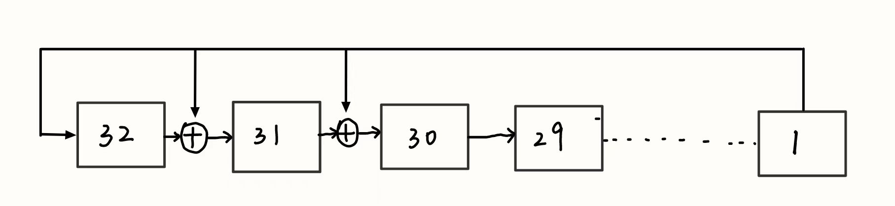
由于0和其他数异或是该数据本身，所以只需要先判断该数最低位是否为0，是零则将该数据逻辑左移，不是0则逻辑左移后与`0xE0000200`异或，即表示进行了1与32，31位和第11位的异或。
```
lu12i.w $r3, 0xe0000
addi.w  $r3, $r3, 0x200    
addi.w   $r8, $r4, 0  // r8 = 1c008000, data address
LFSR:
st.w     $r1, $r8, 0  // store
addi.w   $r8, $r8, 4  // new address
andi      $r9, $r1, 1  // 判断最低位
srli.w   $r1, $r1, 1   // 逻辑左移
beq      $r9, $r0, NEXT_NUM    // 低位为0
xor      $r1, $r1, $r3   // not 0 ，xor
NEXT_NUM: 
addi.w   $r5, $r5, -1  // r5 代表数据个数
bne      $r5, $r0, LFSR  //r5 = 0表示生成数据结束
``` 
**3.读取生成数据**
生成数据结束后进入循环，不断读取开关的值，前十个开关代表索引，根据索引计算得到要读取的数据的地址，取出数据后存入数码管，直至sw10为1，代表进入排序
```
CYCLE:
ld.w     $r10, $r2, 0x60    //load switch
andi     $r10, $r10, 0x3ff   // get index
slli.w   $r10, $r10, 2    // 
add.w    $r10, $r4, $r10   // calculate address
ld.w     $r9, $r10, 0   // load data
st.w     $r9, $r2, 0x50  // store data
ld.w     $r30, $r2, 0x60  // load switch
andi     $r30, $r30, 0x400  // get sw10
beq      $r30, $r0, CYCLE   // judge
```
**4. 排序**
  - **排序算法**
    - 采用优化版的插入算法
    - 首先取出数组两头的数据，分别作为最大值和最小值，同时记录最左侧索引和最右侧索引，取出中间数据分别比较，如果中间其他数据更小或者更大，则更新对应最大最小值，并记录下该数据的索引，一次循环结束得到最大值和最小值，两侧索引向中间逼近，直到左侧索引大于右侧索引循环结束。
    ```
    NEXT:
    addi.w   $r8,  $r12, 0  //r12 = left index
    ld.w     $r10, $r8, 0   //r10 = min data
    addi.w   $r17, $r12, 0  //r17 = min data's index
    addi.w   $r18, $r13, 0  //r18 =  max data's index
    ld.w     $r11, $r13, 0  // r11 = max data
    addi.w   $r15, $r10, 0  // r15 = left data
    addi.w   $r16, $r11, 0  // r16 = right data
    BEGIN:
    ld.w     $r14, $r8, 0    // r14 load mid data

    bgeu     $r14, $r10, MAX // r14 >= r10, 则进行最大值比较
    addi.w   $r10, $r14, 0 // r10 = r14  
    addi.w   $r17, $r8, 0  // r17 = r14'index  
    b       PART         // next data
    MAX: 
    bgeu     $r11, $r14, PART // r11 >= r14 jump   
    addi.w   $r11, $r14, 0  //r11 = r14
    addi.w   $r18, $r8, 0   //update max data's index

    PART:
    addi.w   $r8,  $r8, 4   // next addr
    bgeu     $r13,  $r8, BEGIN  // judge one cycle

    st.w     $r10, $r12, 0   // st min data
    st.w     $r11, $r13, 0   // st max data
    st.w     $r15, $r17, 0   // st origin min data
    st.w     $r16, $r18, 0   // st origin max data
    addi.w   $r12, $r12, 4   // update left index r12
    addi.w   $r13, $r13, -4  // update right index r12
    bltu     $r12, $r13, NEXT  // judg
    ```
  - **排序算法优化考量**
    - 使用两端逼近的插入算法能减少指令执行次数
    - 与冒泡排序相比，该排序不需要每比较一次几乎就要重新存储一次，所以减少了访存次数

**5.时间计数**
- 设置技术标志信号
  利用外设。当开始排序时，让led_rg0变为1，结束排序时，led_rg0变为0，从而作为排序信号。当led_rg0为1时计时，用两个寄存器，一个记录所有排序的总周期方便计算平均用时，一个记录当前周期用时。所以需要借助一个新的信号flag，具体用法如下
  ```verilog
  reg [36:0] cnt;
  reg [36:0] last_cnt ;
  reg flag;
  reg [31:0] every_cnt;
  wire [31:0] ave_cnt ;
  // reg [15:0] left;
  always @(posedge clk) begin
      if(!resetn)            flag <= 0; 
      else if(led_rg0_data)  flag <= 1;// 计时时flag = 1
      else                    flag <= 0; // 不计时时flag = 0
  end
  always @(posedge clk) begin
      if(!resetn) begin
          cnt <= 47'd0;
          every_cnt <= 32'd0;
          last_cnt <= 47'd0;
      end
      else if(led_rg0_data && !flag) 
          last_cnt <= cnt; // 当一次排序刚开始时，把上一次的结果传递给last_cnt
      else if(led_rg0_data && flag) 
          cnt <= cnt + 1; // 计时
      if(!resetn) begin
          every_cnt <= 32'd0;
      end
      else if(!led_rg0_data &&!flag) begin
          every_cnt <= cnt - last_cnt;  // 两次计数之差为当前排序的周期数
      end
      else if(led_rg0_data && flag) begin
          every_cnt <= 32'd0;  
      end
  end
  ```
**6.计数时间的显示**
为了正确利用外设进行时间和排序程序显示的选择，我定义了计数器的外设，当读取相应的地址时，把计数结果读入寄存器，再利用数码管进行显示。当sw15 = 1时表示显示计数结果， sw15 = 0时表示显示排序结果，从而实现交换。当sw10 = 0时表示进入下一次循环。
```verilog
`define TIME_CNT       16'hf0a0  // 每次的count
`define AVE_TIME_CNT       16'hf0b0 //平均cnt
  case (conf_addr[15:0])
      `TIME_CNT      : conf_rdata_reg <= every_cnt;
      `AVE_TIME_CNT  : conf_rdata_reg <= ave_cnt;
  endcase
```
### 2.2 数据cache
#### 2.2.1 状态机
共定义了五个状态
- **IDLE**: 初始状态，有读请求转到READ状态，写请求转到WRITE状态
- **READ**: 读状态，当命中时直接读取，若未命中，则判断该块是否被写入，即是否dirty，若是，则先把该块写回，再进行读数据，若不是dirty，则直接从内存中读数据。
- **WRITE**: 先判断是否命中，命中则直接写入cache，若未命中，先判断该块是否dirty，dirty则先把数据写回后写入cache，反之则直接写入cache。
- **MISS**: 缺失状态，此时从内存读取数据，当读取完成后转向IDLE状态
- **W_DIRTY:** 写回脏数据状态，若需要写cache，则写回脏数据后转向IDLE状态，若是因为读数据缺失，则转向MISS状态
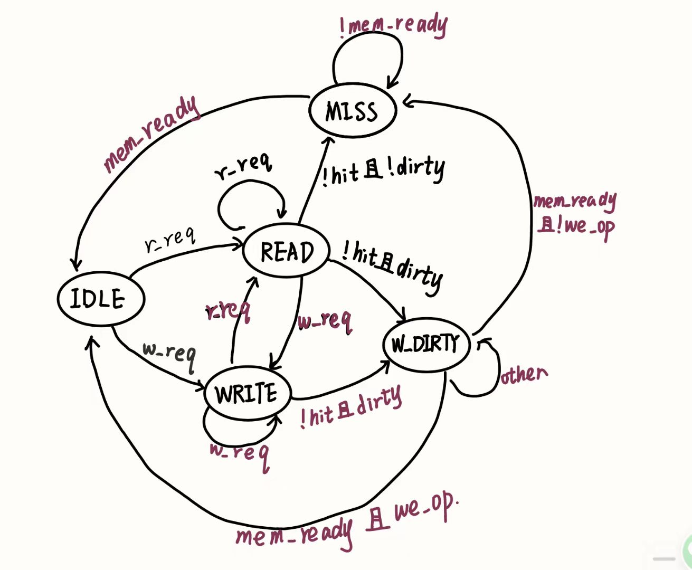


其他各信号与Icache相近。

### 2.3 数据通路优化
由于我在CPU和cache中大量使用了wire型变量，所以导致时间周期有点长，下面选取比较关键的地方优化。
**关键路径**：

**所需时间**
可知在时间限制为25ns的情况下，setup需要22.9ns，其实最初大概是要超出这个时间限制的，但是我忘记截图了，所以我尝试复原了一下，只能这样了。

**优化**
从关键路径可以看出这条路径遍历了Dcache, bridge, CPU, Icache, inst_ram，可以从data_sram_rdata优化，把这个变量改为寄存器类型，从而把关键路径缩短。
**结果**
可知时间减少了大概3ns。

**进一步改进**
再观察可知在新的关键路径中，wire型nextpc变量影响了时间，所以改为reg型，由下图可知，建立时间约17.5ns，优化了2ns，所以一共优化了大概5ns。
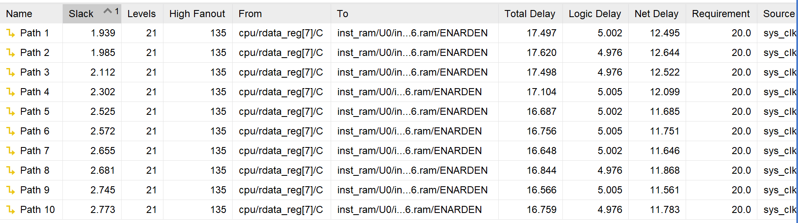
## 3 电路相关
### 3.1 电路图
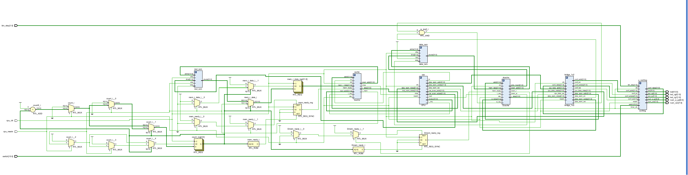
### 3.2 电路资源
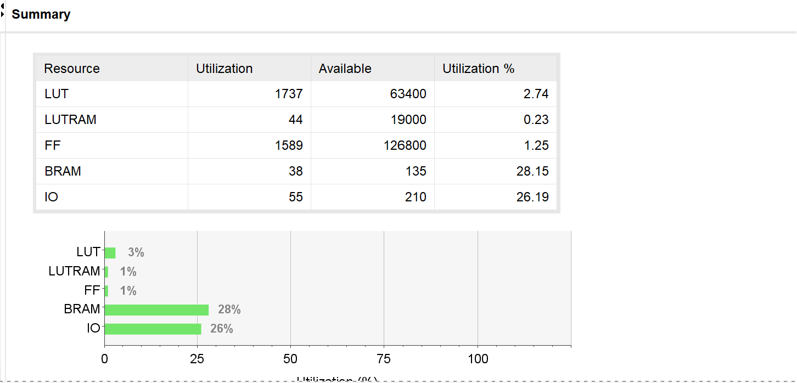
## 4 仿真结果
由于有1024个数据且需要和外设交互，所以波形图仿真结果太过于复杂，在此列举出使用模拟器的运行结果，来验证汇编程序的正确性。
### 4.1 汇编程序生成结果
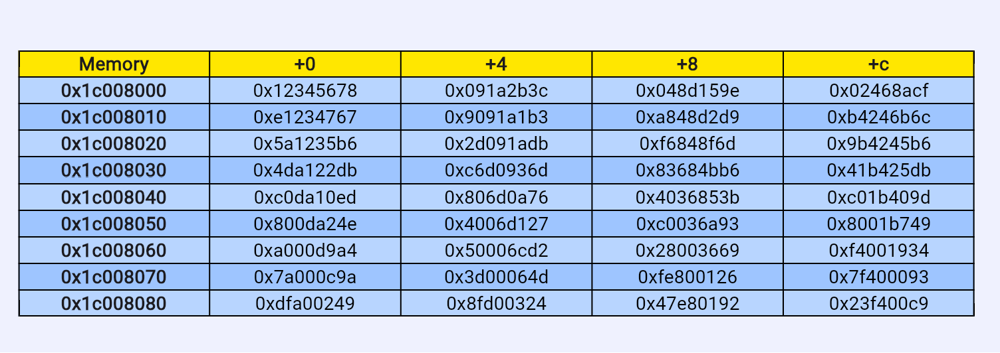
### 4.2 排序结果（从小到大）
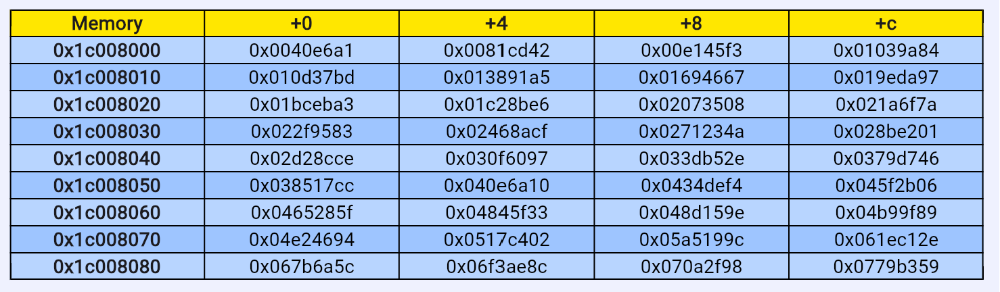
## 5 上板结果
注：本实验结果是在汇编程序中的逻辑右移误写成算术右移的情况下生成的，其他代码及其逻辑和正确的一样，所以可以反应正确性。
**输入N**
输入2，代表一共4组数据
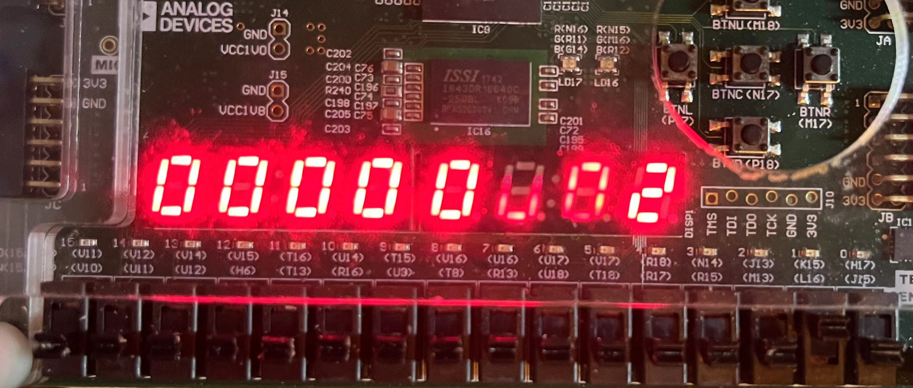
**查看生成数据**
第一组数组的第一个数
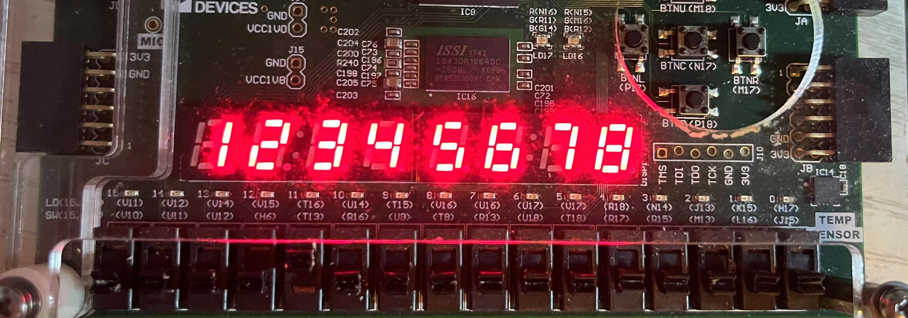
第二个数
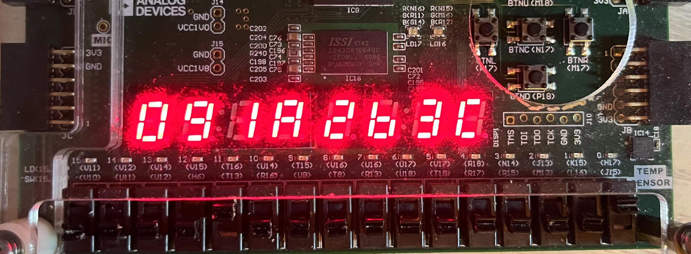
**排序结果**
index = 0
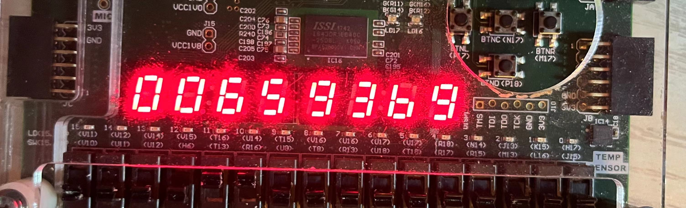

index = 1
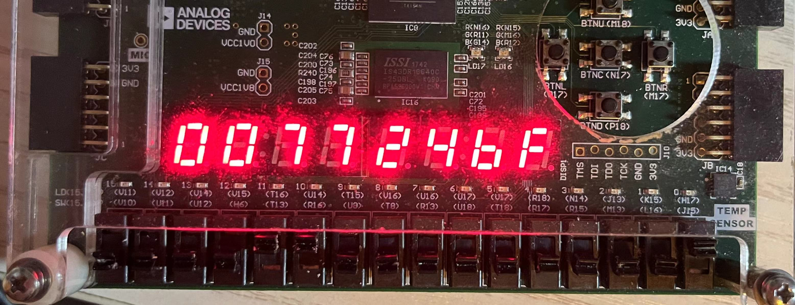

index = 2
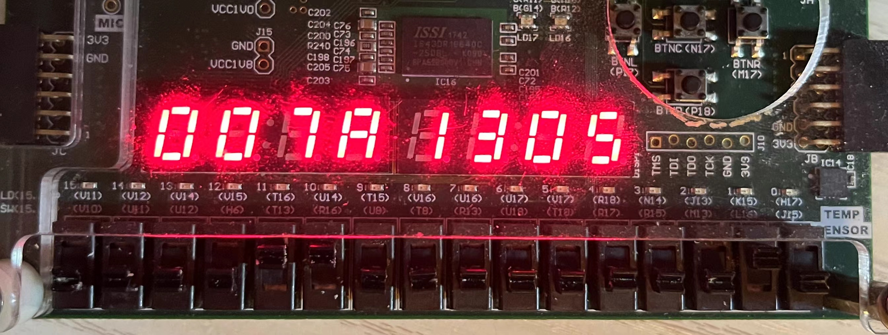
可以看出按从小到大顺序排列
**时间查看**
由于4组数据操作是相同的，所以用一组数据来展示。
第一组时间：
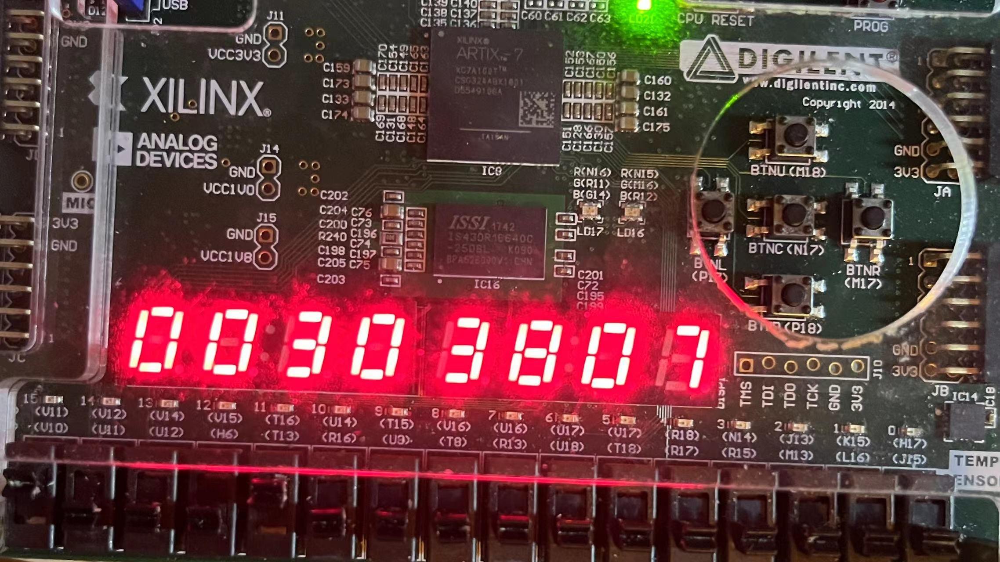
平均时间
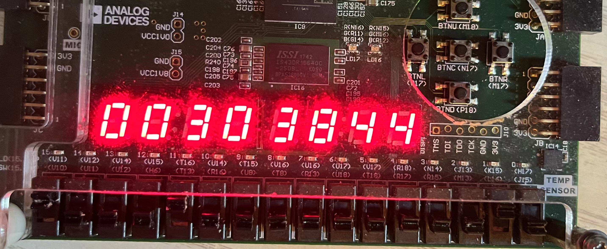
## 6 遇到的问题
1. 
   **问题描述**：最初尝试使用按钮进行组别控制，发现在当时我的汇编逻辑下按钮会导致混乱。
   **解决方法**：可能是因为时序和开关抖动问题。优化汇编程序，减轻与外设交互部分汇编代码的复杂性，并把confreg中开关的扩展为16位，使用开关抖动带来的问题。
   生成bit文件上板后只有第一次
2. **问题描述**：生成bit文件并上板执行时，按照汇编程序应该要先输入数组个数，但结果是直接跳转到生成好数据并显示的部分.
    **解决办法**：检查汇编程序和仿真波形确定无误后，查看WNS发现为负，即限制文件中时钟不满足要求，修改时钟限制解决问题。

3. **问题描述**：把原本的数据内存由dram改为bram后，发现外设和数据内存取出来的时间不同，即外设在地址传过去后能即刻得到，但bram要延后一个周期，导致取出数据的周期状态不同，对数据的处理受到影响。
   **解决方法**：阅读原龙芯文档中dram的confreg.v代码和bram的代码，发现bram的confreg与dram的confreg不同，bram的confreg中rdata是时序逻辑，而dram的confreg是组合逻辑，修改后正确。
## 7 附录（核心/新增部分代码）
### 7.1 汇编程序
```
.text
lu12i.w $r2, 0xbfaff      
lu12i.w $r1, 0x12345
addi.w  $r1, $r1, 0x678    
lu12i.w $r3, 0xe0000
addi.w  $r3, $r3, 0x200    
lu12i.w $r4, 0x1c008        
addi.w  $r31, $r0, 2046
add.w   $r31, $r31, $r31
addi.w  $r25, $r0, 1

READ:
ld.w    $r6, $r2, 0x60     
st.w    $r6, $r2, 0x50
andi    $r7, $r6, 0x800     
beq     $r7, $r0, READ     
andi    $r6, $r6, 0xf   

st.w    $r6, $r2, 0xc0  

addi.w  $r7, $r0, 1         
sll.w   $r7, $r7, $r6      

ADDR:
addi.w   $r5, $r0,1024        
addi.w   $r7, $r7, -1
blt      $r7, $r0, FINISH  

addi.w   $r8, $r4, 0
LFSR:
st.w     $r1, $r8, 0
addi.w   $r8, $r8, 4
andi      $r9, $r1, 1

srli.w   $r1, $r1, 1
beq      $r9, $r0, NEXT_NUM    
xor      $r1, $r1, $r3
NEXT_NUM:
addi.w   $r5, $r5, -1
bne      $r5, $r0, LFSR  

addi.w   $r8, $r4, 0  
CYCLE:

ld.w     $r10, $r2, 0x60  
andi     $r10, $r10, 0x3ff
slli.w   $r10, $r10, 2
add.w    $r10, $r4, $r10
ld.w     $r9, $r10, 0
st.w     $r9, $r2, 0x50 
ld.w     $r30, $r2, 0x60
andi     $r30, $r30, 0x400
beq      $r30, $r0, CYCLE

andi    $r0,  $r0, 0
st.w     $r25, $r2, 0x30

addi.w   $r8, $r4, 0
ld.w     $r10, $r8, 0 
addi.w   $r15, $r10, 0 
add.w    $r13, $r4, $r31
ld.w     $r11, $r13, 0  
addi.w   $r16, $r11, 0 
addi.w   $r12, $r4, 0 


NEXT:
addi.w   $r8,  $r12, 0
ld.w     $r10, $r8, 0
addi.w   $r17, $r12, 0  
addi.w   $r18, $r13, 0  
ld.w     $r11, $r13, 0
addi.w   $r15, $r10, 0
addi.w   $r16, $r11, 0 
BEGIN:
ld.w     $r14, $r8, 0  

bgeu     $r14, $r10, MAX 
addi.w   $r10, $r14, 0   
addi.w   $r17, $r8, 0    
b       PART
MAX:
bgeu     $r11, $r14, PART   
addi.w   $r11, $r14, 0  
addi.w   $r18, $r8, 0  

PART:
addi.w   $r8,  $r8, 4
bgeu     $r13,  $r8, BEGIN 

st.w     $r10, $r12, 0
st.w     $r11, $r13, 0
st.w     $r15, $r17, 0
st.w     $r16, $r18, 0
addi.w   $r12, $r12, 4  
addi.w   $r13, $r13, -4  
bltu     $r12, $r13, NEXT    

st.w     $r0,  $r2, 0x30

FINISH:
ld.w     $r19, $r2, 0x60  
andi     $r19, $r19, 0x3ff
slli.w   $r19, $r19, 2
add.w    $r19, $r4, $r19
ld.w     $r20, $r19, 0
st.w     $r20, $r2, 0x50 

ld.w     $r27, $r2, 0x60
srai.w   $r27, $r27, 4
andi     $r27, $r27, 0x800
bne      $r27, $r0, CNT
blt      $r7, $r0, FINISH

ld.w     $r29, $r2, 0x60
andi     $r29, $r29, 0x400
beq      $r29, $r0, ADDR
andi     $r0, $r0, 0
b   FINISH

CNT: 
blt      $r7, $r0, AVE
ld.w    $r22, $r2, 0xa0
st.w    $r22, $r2, 0x50
b       PART2
AVE:
ld.w    $r23, $r2, 0xb0
st.w    $r23, $r2, 0x50
PART2:
ld.w     $r27, $r2, 0x60
srai.w   $r27, $r27, 4
andi     $r27, $r27, 0x800
beq      $r27, $r0,  FINISH
andi     $r0, $r0, 0
b   CNT


ld.w     $r27, $r2, 0x60
srai.w   $r27, $r27, 4
andi     $r27, $r27, 0x800
beq      $r27, $r0,  FINISH
```
### 7.2 Dcache
```verilog
module Dcache(
    input   wire          clk,
    input   wire          rstn,
    input   wire          r_req,  //读数据请求
    input   wire          w_req,  //写数据请求
    input   wire [31:0]   w_data, //要写入的数据，CPU传来
    input   wire [31:0]   addr,   //要写入或者读取的地址，CPU传来
    output  reg [31:0]   mem_addr, //要读或者写的地址， 传入mem
    input   wire [31:0]   mem_data, //读出的数据  mem传来
    output  reg [31:0]   dirty_mem,
    output  wire [31:0]   r_data,  //读出的数据， 传入CPU
    input   wire          mem_ready,
    output  reg          mem_w, //要写入数据
    output  wire          mem_r, //读内存请求
    output   reg            miss   //  是否缺失
);
parameter IDLE       =      3'd0;
parameter READ       =      3'd1;
parameter WRITE      =      3'd2;
parameter MISS       =      3'd3;
parameter W_DIRTY    =      3'd4;

/*
    读取tag判断是否命中
*/
reg [1:0] used_buf;
reg [1:0] dirty_buf;
reg refill;
reg we_op;
reg w_valid_1;
reg w_valid_2;
reg w_dirty_1;
reg w_dirty_2;
reg [31:0] addr_buf;
wire [19:0]  tag;
wire [9 :0] r_index;
wire [9 :0] w_index;
wire valid_1, valid_2;
wire dirty_1, dirty_2;
wire [19:0] r_tag_1;
wire [19:0] r_tag_2;
assign w_index = addr_buf[11:2];
assign r_index = addr[11:2];
assign tag       = addr_buf[31:12];
reg [1:0] used_update; //更新后的used
reg [31:0]  dirty_mem_addr_buf;
reg [31:0]  dirty_mem_data_buf;
reg tag_we_1;
reg tag_we_2;
wire used_we;
reg [31:0] wb_data; 
Dcache_tag cache_tag_1(
    .clka (clk),
    .ena  (1'b1),
    .wea  (tag_we_1),
    .addra(w_index),
    .dina ({w_valid_1, w_dirty_1, tag}),
    .doutb({valid_1, dirty_1, r_tag_1}),
    .clkb (clk),
    .enb  (1'b1),
    .web  (1'b0),
    .addrb(r_index),
    .dinb (),
    .douta()
);
Dcache_tag cache_tag_2(
    .clka (clk),
    .ena  (1'b1),
    .wea  (tag_we_2),
    .addra(w_index),
    .dina ({w_valid_2 , w_dirty_2, tag}),
    .doutb({valid_2, dirty_2, r_tag_2}),
    .clkb (clk),
    .enb  (1'b1),
    .web  (1'b0),
    .addrb(r_index),
    .dinb (),
    .douta()
);
wire [1:0] used;
history_bram lru(
    .clka (clk),
    .ena  (1'b1),
    .wea  (1'b0),
    .addra(r_index),
    .dina (),
    .douta(used),
    .clkb (clk),
    .enb  (1'b1),
    .web  (used_we),
    .addrb(w_index),
    .dinb (used_update),
    .doutb()
);
// 使用valid表示是否被使用过，表示LRU策略，初始时cache都为0
// 当valid || dirty时表示有效
wire [1:0] hit;
assign  hit   =  {(dirty_1 || valid_1) && (r_tag_1 == tag), (dirty_2 || valid_2) && (r_tag_2 == tag)};

/*
    判断状态机
    初始状态为IDLE，当读请求时到READ， 写请求到WRITE
    对于READ和WRITE需要先判断未hit时是否dirty，dirty需要先写回，即到W_DIRTY状态
*/
reg [1:0] cs;
reg [1:0] ns;
always @(posedge clk or negedge rstn) begin
    if(!rstn)
        cs <= IDLE;
    else
        cs <= ns;
end
always @(*) begin
    case (cs)
        IDLE: begin
            if(r_req) begin
                ns = READ;
            end
            else if(w_req) begin
                ns = WRITE;
            end
            else begin
                ns = IDLE;
            end
        end
        READ: begin
            // miss 且根据LRU策略需要写回的不dirty
            if(miss && ((!dirty_1 && !dirty_2) || (used[1] && !dirty_2) || (used[0] && !dirty_1))) begin
                ns = MISS;
            end
            // miss且根据LRU策略需要写回
            else if(miss && ((dirty_1 && used[2]) || (dirty_2 && used[1])))
                ns = W_DIRTY; //需要写回脏数据
            else if(r_req) begin
                ns = READ;
            end
            else if(w_req) begin
                ns = WRITE;
            end
            else begin
                ns = IDLE;
            end
        end
        MISS:begin
            if(mem_ready) begin
                ns = IDLE;
            end
            else begin
                ns = MISS;
            end
        end
        WRITE: begin
            // if(miss && ((!dirty_1 && !dirty_2) || (used[1] && !dirty_2) || (used[0] && !dirty_1))) begin
            //     ns = ;  //MISS 且不需要写回
            //     // ns = IDLE;
            // end
            if(miss && ((dirty_1 && used[2]) || (dirty_2 && used[1]))) begin
                ns = W_DIRTY;
            end
            else if(r_req) begin
                ns = READ;
            end
            else if(w_req) begin
                ns = WRITE;
            end
            else begin
                ns = IDLE;
            end
        end
        W_DIRTY: begin
            if (mem_ready && !we_op) begin
                // ns = MISS; // 写回后转到miss
                ns = MISS;
            end
            else if(mem_ready && we_op) begin
                ns = IDLE;
            end
            else begin
                ns = W_DIRTY;
            end
        end
        default: ns  = IDLE;
    endcase
end

/*
    各种信号
*/

wire data_from_mem;
wire addr_buf_we;
wire ret_buf_we;
wire [31:0] dirty_addr ;
wire [31:0] cache_rdata_1;
wire [31:0] cache_rdata_2;
// reg cache_we_1;
// reg cache_we_2;
// dirty_buf记录dirty值
// used_buf记录used值
assign dirty_addr = {used[1] ? r_tag_2 : r_tag_1, w_index, 2'b00};
assign addr_buf_we = (cs == IDLE || (cs == READ && hit) || (cs == WRITE && hit)) ? 1'b1: 1'b0;
assign ret_buf_we = (cs == MISS && mem_ready) ? 1'b1 : 1'b0;
assign data_from_mem = (cs == IDLE && refill) ? 1'b1 : 1'b0;
assign used_we = (cs == IDLE && refill) || ((cs == READ || cs == WRITE) && hit) ? 1'b1 : 1'b0;
assign mem_r = (cs == MISS && !mem_ready) ? 1'b1 : 1'b0;
// assign miss = (((cs == READ || cs == WRITE) && !hit[1] && !hit[0]) || (cs == MISS) || (cs == W_DIRTY)) ? 1'b1 : 1'b0;
always @(*) begin
    tag_we_1 = 1'b0;
    tag_we_2 = 1'b0;
    w_dirty_1 = 1'b0;
    w_dirty_2 = 1'b0;
    w_valid_1   = 1'b0; 
    w_valid_2   = 1'b0;
    used_update = 2'b00;
    mem_w = 1'b0;
    dirty_mem   = 32'd0;
    mem_addr = 32'd0;
    case (cs)
        IDLE: begin
            miss        = 1'b0;
            if(refill) begin  //需要将读出的数据写回或者传给CPU
                if(used_buf[1]) begin //表示要写入第二个
                    tag_we_2    = 1'b1;
                    tag_we_1    = 1'b0;
                    w_valid_1   = 1'b1;
                    w_valid_2   = 1'b1;
                    used_update = 2'b01;
                end
                else if(used_buf[0]) begin
                    tag_we_1    = 1'b1;
                    tag_we_2    = 1'b0;
                    w_valid_1   = 1'b1; 
                    w_valid_2   = 1'b0; 
                    used_update = 2'b10;
                end
                else begin //最初时
                    tag_we_1    = 1'b1;
                    tag_we_2    = 1'b0;
                    w_valid_1   = 1'b1;
                    w_valid_2   = 1'b0;
                    used_update = 2'b10;
                end
                 //表示从cpu写回数据
                if(we_op && used_buf[1]) begin //写第二块
                    w_dirty_1  = dirty_buf[1];
                    w_dirty_2  = 1'b1;

                end
                else if(we_op && used_buf[0]) begin
                    w_dirty_1  = 1'b1;
                    w_dirty_2 = dirty_buf[0];
                end
                else if(we_op && !used_buf[1] && !used_buf[0]) begin
                    w_dirty_1 = 1'b1;
                    w_dirty_2 = 1'b0;
                end
                else begin
                    w_dirty_1 = 1'b0;
                    w_dirty_2 = 1'b0;
                end               
            end
        end 
        READ: begin
            if(hit) begin
                miss = 1'b0;
                if(hit[1]) begin
                    used_update = 2'b10;
                end
                else begin
                    used_update = 2'b01;
                end
            end
            else begin  //未命中

                miss = 1'b1;
                // addr_buf_we = 1'b0;
                //未命中但是有脏数据，则需要写回
                if(((dirty_1 && used[2]) || (dirty_2 && used[1]))) begin
                    mem_w = 1'b1;
                    mem_addr = dirty_addr;
                    //used这些都是该周期读出的
                    dirty_mem = (dirty_1 && used[2]) ? cache_rdata_1 : cache_rdata_2;
                end
            end
        end 
        MISS: begin
            miss = 1'b1;
            mem_addr = addr_buf;
        end                
        WRITE: begin
           
            if (hit) begin // 命中
                miss = 1'b0;
                // addr_buf_we = 1'b1; // 请求地址缓存写使能
                // used_we = 1'b1;
                 mem_w   = 1'b0;
                if(hit[1]) begin
                    w_valid_1 = 1'b1;
                    w_valid_2 = valid_2;
                    w_dirty_1 = 1'b1;
                    w_dirty_2 = dirty_2;
                    used_update = 2'b10;
                    tag_we_1 = 1'b1;
                    tag_we_2 = 1'b0;
                end
                else if(hit[0]) begin
                    w_valid_1 = 1'b1;
                    w_valid_2 = valid_2;
                    w_dirty_2 = 1'b1;
                    w_dirty_1 = dirty_1;
                    tag_we_2 = 1'b1;
                    tag_we_1 = 1'b0;
                    used_update = 2'b01;
                end
            end else begin // 未命中
                miss = 1'b1;
                // addr_buf_we = 1'b0; 
                if(((dirty_1 && used[2]) || (dirty_2 && used[1]))) begin
                    mem_w = 1'b1;
                    mem_addr = dirty_addr;
                    //used这些都是该周期读出的
                    dirty_mem = (dirty_1 && used[2]) ? cache_rdata_1 : cache_rdata_2;
                end
                else begin
                    if(used[1]) begin
                        tag_we_2 = 1'b1;
                        tag_we_1 = 1'b0;
                        used_update = 2'b01;
                        w_dirty_2 = 1'b1;
                        w_dirty_1 = 1'b0;
                        w_valid_1 = 1'b1;
                        w_valid_2 = 1'b1;
                    end
                    else if(used[0]) begin
                        tag_we_2 = 1'b0;
                        tag_we_1 = 1'b1;
                        used_update = 2'b10;
                        w_dirty_2 = 1'b0;
                        w_dirty_1 = 1'b1;
                        w_valid_1 = 1'b1;
                        w_valid_2 = 1'b1;                        
                    end
                    else begin
                        tag_we_2 = 1'b0;
                        tag_we_1 = 1'b1;
                        used_update = 2'b10;
                        w_dirty_2 = 1'b0;
                        w_dirty_1 = 1'b1;
                        w_valid_1 = 1'b1;
                        w_valid_2 = 1'b0;
                    end
                end
            end
        end
        W_DIRTY: begin
            // addr_buf_we = 1'b0;
            miss = 1'b1;
            mem_w = 1'b1;
            mem_addr = dirty_mem_addr_buf;
            dirty_mem = dirty_mem_data_buf;
            if (mem_ready) begin
                mem_w = 1'b0;
            end
        end
        default:;
    endcase
end
reg [31:0] ret_buf;
always @(posedge clk or negedge rstn) begin
    if (!rstn) begin
        addr_buf <= 0;
        ret_buf <= 0;
        // w_data_buf <= 0;
        wb_data <= 32'd0;
        we_op <= 0;
        refill <= 0;
    end else begin
        if (addr_buf_we) begin
            wb_data <= w_data;
            addr_buf <= addr;
            we_op <= w_req;
            dirty_mem_addr_buf <= dirty_addr;
            used_buf <= used;
            dirty_buf <= {dirty_1, dirty_2};
        end
        if(cs == READ) begin
            dirty_mem_data_buf <= (dirty_1 && used[2]) ? cache_rdata_1 : cache_rdata_2; 
        end
        if (ret_buf_we) begin
            ret_buf <= mem_data;
        end
        if (cs == MISS && mem_ready) begin
            refill <= 1;
        end
        if(cs == W_DIRTY && we_op && mem_ready) begin
            refill <= 1;
        end
        if (cs == IDLE) begin
            refill <= 0;
        end
    end
end
wire [31:0] true_data;
assign true_data = we_op ? w_data : (data_from_mem ? ret_buf : 
                    ((cs == READ) && hit[1]  ? cache_rdata_1: 
                    (cs == READ) && hit[0] ? cache_rdata_2 : 32'd0));
assign r_data = data_from_mem ? ret_buf : 
((cs == READ) && hit[1]  ? cache_rdata_1: 
(cs == READ) && hit[0] ? cache_rdata_2 : 32'd0);
cache_data cache_data_1(
    .clka (clk),
    .ena  (1'b1),
    .wea  (tag_we_1),
    .addra(w_index),
    .dina (true_data),
    .douta(),
    .clkb (clk),
    .enb  (1'b1),
    .web  (1'b0),
    .addrb(r_index),
    .dinb (),
    .doutb(cache_rdata_1)
);
cache_data cache_data_2(
    .clka (clk),
    .ena  (1'b1),
    .wea  (tag_we_2),
    .addra(w_index),
    .dina (true_data),
    .douta(),
    .clkb (clk),
    .enb  (1'b1),
    .web  (1'b0),
    .addrb(r_index),
    .dinb (),
    .doutb(cache_rdata_2) 
);
endmodule
```
###